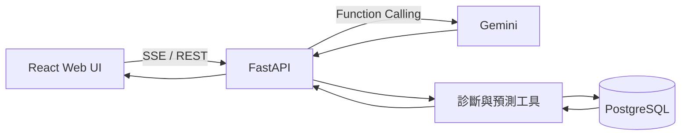

# EdgeMind — 邊緣設備診斷與溫度預測

EdgeMind 是一套面向工業馬達與邊緣設備的 AI 診斷系統。系統整合感測資料採集、30 分鐘溫度預測與 Gemini Agent，將即時數據轉換為可讀的設備狀態、風險說明與維護建議。

> 從感測資料到可執行決策：數值模型負責預測，AI Agent 負責查詢、解釋與互動。

[Docker 部署](#docker-部署) · [快速啟動](#5-分鐘快速啟動) · [預測模型](#預測模型) · [API](#api-參考) · [資料庫](#查看資料庫) · [正式部署](#正式部署基線)

## 核心能力

- 查詢設備最新的溫度、濕度、XYZ 三軸與震動狀態
- 使用五項感測特徵預測 30 分鐘後溫度
- 回報模型驗證 MAE、RMSE 與有效樣本數
- 透過聊天介面取得異常分析與維護建議
- 使用 FastAPI、PostgreSQL 與 Docker Compose 快速部署
- 以預載的 DEMO-1 資料立即體驗完整流程

## Docker 部署

本專案已提供可直接使用的 [`docker-compose.yml`](./docker-compose.yml)，可一次啟動前端、後端與 PostgreSQL。

開始前請依使用環境選擇一種安裝方式：

- [Docker Desktop](https://docs.docker.com/desktop/)：適合 Windows、macOS 與桌面 Linux，已內含 Docker Engine、Docker CLI 與 Docker Compose。
- [Docker Engine](https://docs.docker.com/engine/install/)：適合 Linux 或伺服器環境；安裝後請另外安裝 [Docker Compose Plugin](https://docs.docker.com/compose/install/)。

安裝完成後，可用以下指令確認環境：

```bash
docker --version
docker compose version
```

## 5 分鐘快速啟動

需求：[Docker Desktop](https://docs.docker.com/desktop/)，或 [Docker Engine](https://docs.docker.com/engine/install/) 搭配 [Docker Compose Plugin](https://docs.docker.com/compose/install/)，以及有效的 Gemini API Key。

```bash
git clone https://github.com/programmerKB/Edge-mind.git
cd Edge-mind
```

在專案根目錄建立 `.env`：

```dotenv
GEMINI_API_KEY=你的_Gemini_API_Key

POSTGRES_USER=agent_user
POSTGRES_PASSWORD=請改成高強度密碼
POSTGRES_DB=motor_monitor_db
DATABASE_URL=postgresql://agent_user:請改成高強度密碼@db:5432/motor_monitor_db

# 正式環境可設為 false
SEED_DEMO_DATA=true
```

`POSTGRES_PASSWORD` 必須與 `DATABASE_URL` 中的密碼一致。真實 API Key 與密碼不可提交到 Git。

啟動服務：

```bash
docker compose up -d --build
docker compose ps
```

開啟：

- Web UI：<http://localhost:5173>
- Swagger API：<http://localhost:8000/docs>
- Backend：<http://localhost:8000>

查看日誌：

```bash
docker compose logs --tail=100 backend
```

## 立即驗證預測

後端第一次啟動時會建立 `DEMO-1`，寫入 36 筆、每 5 分鐘一筆的合成歷史資料。重啟不會重複寫入。

訓練模型：

```bash
curl -X POST http://127.0.0.1:8000/api/predictions/train/DEMO-1
```

預測 30 分鐘後溫度：

```bash
curl http://127.0.0.1:8000/api/predictions/temperature/DEMO-1
```

或在 Web UI 輸入：

```text
請預測 DEMO-1 在 30 分鐘後的溫度，並說明模型誤差
```

`DEMO-1` 僅供功能展示，不代表真實設備表現。正式環境應設定 `SEED_DEMO_DATA=false`。

## 預測模型

EdgeMind 為每台設備分別訓練模型，避免不同機台的負載、環境與振動特性互相干擾。

### 模型規格

| 項目 | 設計 |
| --- | --- |
| 輸入特徵 | 溫度、濕度、加速度 X、Y、Z |
| 預測目標 | 30 分鐘後的溫度 |
| 模型 | Ridge Regression（L2 正則化線性回歸） |
| 最少資料 | 12 組有效的「當下 → 30 分鐘後」配對 |
| 時間容許 | 尋找 30 分鐘後最近的紀錄，容許 ±5 分鐘 |
| 驗證方式 | 依時間排序，前段訓練、最後 20% 驗證 |
| 評估指標 | MAE、RMSE |
| 模型保存 | JSON 形式保存於 PostgreSQL |

模型先將各特徵標準化，再估計：

```text
預測溫度(t + 30 分鐘) = 截距 + Σ（特徵權重 × 標準化特徵）
```

Ridge Regression 會對過大的權重加入 L2 懲罰，在特徵彼此相關或資料量有限時，比一般線性回歸更穩定。

### 訓練與推論流程

1. 依設備與時間排序歷史資料。
2. 以當下五項感測值作為特徵。
3. 將最接近 30 分鐘後的實際溫度作為標籤。
4. 標準化五項特徵並訓練 Ridge Regression。
5. 使用時間序列尾端資料計算 MAE 與 RMSE。
6. 使用全部有效資料重新訓練並保存模型。
7. 以最新一筆完整感測資料產生預測。

Ridge Regression 適合此專案的邊緣情境：模型小、訓練與推論快速、結果可解釋，也不需要額外的大型 ML 套件。若設備關係高度非線性或資料量大幅增加，可再比較 Random Forest、Gradient Boosting 或序列模型。

指標解讀：

- **MAE**：平均絕對誤差，直觀反映預測平均偏差多少 °C。
- **RMSE**：均方根誤差，會對少數較大的誤差給予更高懲罰。

> MAE 與 RMSE 越低通常代表驗證誤差越小，但合成資料上的低誤差不等於真實環境準確度。上線前應使用各設備的真實歷史資料重新訓練與驗證。

## 系統架構



Gemini 負責理解問題、選擇工具與整理回答；數值預測由後端 Ridge 模型執行，不是由 Gemini 生成或猜測。

## 技術組成

| 分層 | 技術 |
| --- | --- |
| Web UI | React 19、Vite、Lucide React、React Markdown |
| API | Python 3.11、FastAPI、Pydantic、Uvicorn |
| Agent | Google Gemini、Google Gen AI SDK |
| 資料 | PostgreSQL 16、SQLAlchemy |
| 預測 | Python 標準函式庫實作的 Ridge Regression |
| 部署 | Docker、Docker Compose |

## API 參考

| 方法 | 路徑 | 用途 |
| --- | --- | --- |
| POST | `/api/chat_utf8` | Agent SSE 聊天 |
| POST | `/api/sensor-readings` | 寫入一筆完整感測資料 |
| POST | `/api/predictions/train/{motor_id}` | 訓練並保存設備模型 |
| GET | `/api/predictions/temperature/{motor_id}` | 預測 30 分鐘後溫度 |

### 寫入感測資料

感測資料契約：

| 欄位 | 型別 | 必填 | 說明 |
| --- | --- | --- | --- |
| `motor_id` | string | 是 | 設備唯一識別碼 |
| `temperature` | number | 是 | 當下溫度 |
| `humidity` | number | 是 | 相對濕度，範圍 0–100 |
| `accel_x` | number | 是 | X 軸加速度 |
| `accel_y` | number | 是 | Y 軸加速度 |
| `accel_z` | number | 是 | Z 軸加速度 |
| `recorded_at` | ISO 8601 datetime | 否 | 未提供時由資料庫建立時間 |
| `status` | string | 否 | 預設為 `normal` |

```bash
curl -X POST http://127.0.0.1:8000/api/sensor-readings \
  -H "Content-Type: application/json" \
  -d '{
    "motor_id": "M1",
    "temperature": 43.2,
    "humidity": 56.8,
    "accel_x": 0.12,
    "accel_y": -0.04,
    "accel_z": 1.01,
    "recorded_at": "2026-08-09T10:00:00+08:00",
    "status": "normal"
  }'
```

數值必須是有限值。每筆訓練來源資料都必須包含五項特徵；累積足夠歷史後執行：

```bash
curl -X POST http://127.0.0.1:8000/api/predictions/train/M1
curl http://127.0.0.1:8000/api/predictions/temperature/M1
```

完整 request/response schema 請查看 <http://localhost:8000/docs>。

## 查看資料庫

進入 PostgreSQL：

```bash
docker compose exec db psql -U agent_user -d motor_monitor_db
```

如果目前帳號沒有 Docker socket 權限，可在 Docker 指令前加上 `sudo`。

查看每台設備的資料量與時間範圍：

```sql
SELECT
    motor_id,
    COUNT(*) AS reading_count,
    MIN(recorded_at) AS first_record,
    MAX(recorded_at) AS latest_record
FROM motor_sensor_data
GROUP BY motor_id
ORDER BY motor_id;
```

查看 DEMO-1 最新資料：

```sql
SELECT
    temperature,
    humidity,
    accel_x,
    accel_y,
    accel_z,
    recorded_at
FROM motor_sensor_data
WHERE motor_id = 'DEMO-1'
ORDER BY recorded_at DESC
LIMIT 10;
```

查看已訓練模型：

```sql
SELECT motor_id, sample_count, mae, rmse, trained_at
FROM temperature_forecast_models
ORDER BY trained_at DESC;
```

輸入 `\q` 離開 PostgreSQL。

## 專案結構

```text
.
├── backend/
│   ├── main.py             # FastAPI、SSE、資料寫入與預測 API
│   ├── forecasting.py      # 特徵配對、訓練、驗證與推論
│   ├── seed_data.py        # DEMO-1 合成歷史資料
│   ├── models.py           # 感測資料與模型資料表
│   ├── migrations.py       # 舊資料庫欄位升級
│   ├── tools.py            # Gemini 可呼叫的診斷／預測工具
│   └── tests/
├── frontend/
│   └── src/App.jsx         # 聊天介面與 SSE 串流
├── docker-compose.yml
└── README.md
```

## 區域網路與行動裝置

建立 `frontend/.env.local`：

```dotenv
VITE_API_URL=http://192.168.1.50:8000/api/chat_utf8
```

將 IP 換成部署主機實際位址，然後重啟前端：

```bash
docker compose restart frontend
```

瀏覽器開啟：

```text
http://192.168.1.50:5173
```

部署主機與使用者設備必須網路互通，防火牆需允許 TCP 5173 與 8000。行動裝置中的 `127.0.0.1` 指向裝置本身，不是部署主機。

## 測試與品質檢查

後端測試：

```bash
cd backend
python -m unittest discover -s tests -v
```

前端檢查：

```bash
cd frontend
npm run lint
npm run build
```

常用維運：

```bash
docker compose ps
docker compose logs -f backend
docker compose restart backend
docker compose up -d --build
docker compose down
```

`docker compose down` 不會刪除 PostgreSQL volume。不要把 `docker compose down -v` 當作一般重啟；它會永久刪除資料庫 volume。

## 備份與還原

備份：

```bash
docker compose exec -T db \
  pg_dump -U agent_user motor_monitor_db > motor_monitor_backup.sql
```

還原：

```bash
docker compose exec -T db \
  psql -U agent_user -d motor_monitor_db < motor_monitor_backup.sql
```

正式環境應定期自動備份，並實際驗證還原流程。

## 常見問題

### 網頁無法開啟

```bash
docker compose ps
docker compose logs --tail=100 frontend
curl -I http://127.0.0.1:5173
```

### Agent 沒有回應

```bash
docker compose logs --tail=200 backend
```

確認 `GEMINI_API_KEY` 有效、帳號可使用 `backend/main.py` 中的 `MODEL_ID`，且主機可連線 Google API。

### 前端顯示 Failed to fetch

確認：

- <http://localhost:8000/docs> 可以開啟
- `VITE_API_URL` 包含 `/api/chat_utf8`
- 瀏覽器使用正確的主機 IP
- 防火牆允許 8000
- HTTPS 前端沒有呼叫 HTTP 後端

### 資料庫連線失敗

Docker 中的後端必須使用 `db:5432`；直接在主機執行後端時才使用 `127.0.0.1:5432`。

```bash
docker compose logs --tail=100 db
```

### Docker 權限不足

可暫時使用 `sudo docker ...`，或依作業系統設定 Docker 使用者群組。重新登入後再測試 `docker ps`。

## 已知限制

- 預測模型假設特徵與目標近似線性，未涵蓋複雜的長期序列效應。
- 新感測資料不會自動觸發重新訓練；請依資料量或時間週期呼叫訓練 API。
- 驗證指標來自單次時間切分，不等同跨季節、跨負載條件的完整驗證。
- 目前沒有使用者登入、細粒度授權、rate limit 與完整稽核機制。
- `DEMO-1` 是合成資料，只能用來確認流程是否運作。

## 正式部署基線

目前 Compose 適合開發、展示與可信任內網。公開部署前至少應：

- 關閉 `SEED_DEMO_DATA`
- 前端改用 production build 與正式 Web Server
- 後端移除 Uvicorn `--reload`
- 將 CORS 限制為實際前端網域
- 不對外公開 PostgreSQL 5432
- 啟用 HTTPS、登入驗證、授權與 rate limit
- 使用 secret manager 保存 API Key 與資料庫密碼
- 加入健康檢查、監控、告警與自動備份
- 使用真實設備資料重新訓練並制定可接受誤差

## License

目前專案尚未加入 License。散布、商業使用或交付第三方前，請先補上授權條款。
