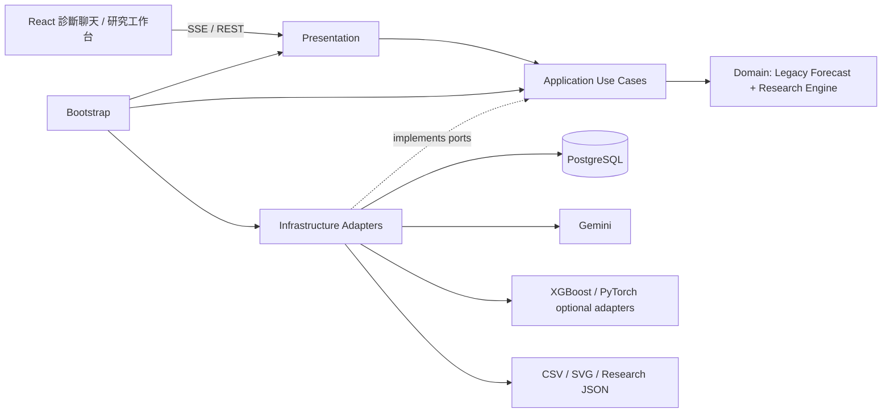

# EdgeMind — 邊緣設備診斷與多時域溫度風險研究

EdgeMind 是一套面向工業馬達與邊緣設備的 AI 診斷及研究系統。它保留既有 30 分鐘即時 Ridge 預測與 Gemini Agent，並新增「過去 60 分鐘五感測序列 → 未來 +5～+30 分鐘溫度軌跡 → 過熱風險」的可重現研究工作台。

> 數值模型負責計算預測，Gemini Agent 負責理解問題、選擇工具與整理回答；Agent 不會自行猜測設備數據。

## 文件導覽

- [主要功能](#主要功能)
- [快速啟動](#快速啟動)
- [使用方式](#使用方式)
- [系統架構](#系統架構)
- [預測模型](#預測模型)
- [研究工作台](#研究工作台)
- [研究資料集](#研究資料集)
- [推論報表與圖表](#推論報表與圖表)
- [API 參考](#api-參考)
- [開發與測試](#開發與測試)
- [部署與維運](#部署與維運)
- [常見問題](#常見問題)

## 主要功能

- 查詢設備最新溫度、濕度、XYZ 三軸加速度與震動狀態。
- 保留五項單點感測特徵預測 30 分鐘後溫度的正式服務端點。
- 以最近 12 筆（60 分鐘）資料直接預測 +5、+10、+15、+20、+25、+30 分鐘溫度軌跡。
- 公平比較 Persistence、Direct Ridge、Ridge + History/Trend、XGBoost、GRU、LSTM、TCN、DLinear、Transformer 與 PatchTST；未安裝的研究依賴會標成 unavailable，不會產生假結果。
- 內建 60/20/20 時間切分、30 分鐘 purged gap、3-fold walk-forward、五組特徵消融與跨設備完全保留測試。
- 將軌跡轉為最高溫、門檻穿越、Time-to-threshold、溫升率與 Low/Medium/High 風險。
- 支援以 A 設備訓練模型，再用該模型推論 B 設備。
- 提供 MAE、MSE、RMSE、R²、MAPE 與誤差中位數等回歸指標。
- 提供混淆矩陣、Precision、Recall、Specificity、F1、ROC-AUC 與 PR-AUC 等異常偵測指標。
- 彙整多次推論的平均值、中位數、標準差與 P90／P95／P99 效能。
- 後端產生 CSV 與 SVG 圖表，並透過 REST 或 SSE 將圖片附件交給前端顯示。
- 內建互相分離的 `DEMO-1` 訓練資料與 `DEMO-2` 推論資料，可快速驗證完整流程。

## 技術組成

| 分層 | 技術 |
| --- | --- |
| Web UI | React 19、Vite 8、React Markdown、Lucide React |
| API | Python 3.11、FastAPI、Pydantic、Uvicorn |
| Agent | Google Gemini、Google Gen AI SDK |
| 資料庫 | PostgreSQL 16、SQLAlchemy |
| 預測 | 標準函式庫 Ridge/Persistence；研究環境可選 XGBoost 與 PyTorch GRU/LSTM/TCN/DLinear/Transformer/PatchTST |
| 部署 | Docker、Docker Compose |

後端正式服務依賴在 [`backend/requirements.txt`](./backend/requirements.txt) 精確鎖定；重型研究 adapter 另在 [`backend/requirements-research.txt`](./backend/requirements-research.txt) 鎖定，避免放大一般 edge runtime。前端直接與間接依賴由 [`frontend/package-lock.json`](./frontend/package-lock.json) 鎖定。

## 快速啟動

### 1. 準備環境

需要以下工具：

- Git
- 有效的 Gemini API Key
- [Docker Desktop](https://docs.docker.com/desktop/)，或 [Docker Engine](https://docs.docker.com/engine/install/) 搭配 [Docker Compose Plugin](https://docs.docker.com/compose/install/)

確認 Docker 可用：

```bash
docker --version
docker compose version
```

### 2. 取得專案

```bash
git clone https://github.com/programmerKB/Edge-mind.git
cd Edge-mind
```

### 3. 建立環境設定

先複製部署範本，再修改 `.env`：

```bash
cp .env.example .env
```

```dotenv
GEMINI_API_KEY=你的_Gemini_API_Key
GEMINI_MODEL_ID=gemini-3.5-flash-lite

POSTGRES_USER=agent_user
POSTGRES_PASSWORD=請改成高強度密碼
POSTGRES_DB=motor_monitor_db
DATABASE_URL=postgresql://agent_user:請改成高強度密碼@db:5432/motor_monitor_db

# 完整十模型 CPU 環境；edge-only 部署才改成 requirements.txt
BACKEND_REQUIREMENTS_FILE=requirements-research.txt

# 展示／研究工作台使用 true；正式真實資料環境改成 false
SEED_DEMO_DATA=true

# 推論輸出與異常判定
INFERENCE_OUTPUT_DIR=/app/outputs
REPORT_TIMEZONE_OFFSET_HOURS=8
ANOMALY_TEMPERATURE_THRESHOLD=35.0

# Gemini 單次回應最長等待秒數
AGENT_RESPONSE_TIMEOUT_SECONDS=60

# 多個來源用逗號分隔；正式環境填實際 HTTPS 網域
CORS_ORIGINS=http://localhost:5173
```

`POSTGRES_PASSWORD` 必須與 `DATABASE_URL` 中的密碼一致。`.env` 已被 Git 忽略，請勿提交真實 API Key 或密碼。

### 4. 啟動服務

```bash
./deploy.sh
```

腳本會先驗證 `.env` 與 Compose、建立映像、啟動服務，並等待 PostgreSQL、後端與前端全部通過健康檢查；也可手動執行 `docker compose up -d --build`。

服務入口：

- Web UI：<http://localhost:5173>
- Swagger API：<http://localhost:8000/docs>
- Backend：<http://localhost:8000>

若服務未正常啟動：

```bash
docker compose logs --tail=100 backend
docker compose logs --tail=100 frontend
```

## 使用方式

### Web UI

開啟 <http://localhost:5173>，輸入：

```text
請使用 DEMO-1 訓練的模型，推論 DEMO-2 在 30 分鐘後的溫度，並說明模型誤差
```

後端會執行確定性的預測工具，先透過 SSE 回傳執行狀態與 SVG 圖表附件，再由 Gemini 根據真實工具結果整理繁體中文說明。

多時域軌跡與風險也有確定性 Agent 路由：

```text
請使用 DEMO-1 訓練的 Ridge History 模型，預測 DEMO-2 未來 5 到 30 分鐘的溫度軌跡與過熱風險
```

側欄切換到「研究工作台」後，可以選擇訓練／外部評估設備、history、horizons、溫度門檻與最新軌跡推論模型。「預測最新軌跡」只使用最新 12 筆及預測起點前可得的訓練標籤，六個未來真值標成 `pending`；「啟動完整實驗」則呈現資料品質與無洩漏稽核、模型比較、各 horizon 誤差、特徵消融、edge 效率及保留測試集軌跡。兩種結果分開顯示。`DEMO-1/2` 只適合確認 UI 與 API 流程。

### REST API

先訓練模型：

```bash
curl -X POST http://127.0.0.1:8000/api/predictions/train/DEMO-1
```

再使用 `DEMO-1` 模型推論 `DEMO-2`：

```bash
curl 'http://127.0.0.1:8000/api/predictions/temperature/DEMO-2?training_motor_id=DEMO-1&auto_train=false'
```

執行多 horizon 研究實驗：

```bash
curl -X POST http://127.0.0.1:8000/api/research/experiments \
  -H 'Content-Type: application/json' \
  -d '{
    "training_motor_id": "DEMO-1",
    "evaluation_motor_id": "DEMO-2",
    "history_minutes": 60,
    "horizons_minutes": [5, 10, 15, 20, 25, 30],
    "threshold_c": 35,
    "model_names": ["persistence", "ridge_direct", "ridge_history_trend"],
    "include_ablations": true
  }'
```

以 `DEMO-1` 的已知歷史標籤擬合模型，對 `DEMO-2` 最新完整 12 筆產生尚待真值回填的六點軌跡：

```bash
curl -X POST http://127.0.0.1:8000/api/research/forecasts \
  -H 'Content-Type: application/json' \
  -d '{
    "motor_id": "DEMO-2",
    "training_motor_id": "DEMO-1",
    "model_name": "ridge_history_trend",
    "history_minutes": 60,
    "horizons_minutes": [5, 10, 15, 20, 25, 30],
    "threshold_c": 35
  }'
```

回應只包含實際計算值。研究比較以 `experiment_id` 保存 JSON 與 CSV；最新軌跡以 `forecast_id` 另存 immutable JSON，並明確記錄 `truth_status=pending` 及 leakage audit。Compose 預設安裝七個 CPU-only 重型研究模型；若只需三個輕量 baseline，可改用：

```bash
BACKEND_REQUIREMENTS_FILE=requirements.txt docker compose build backend
docker compose up -d backend frontend
```

第一次啟動時，系統會建立兩個不重複寫入的合成資料集：

- `DEMO-1`：7 天／2,016 筆、每 5 分鐘一筆，含多負載、磨耗與暫態事件，僅用於模型訓練。
- `DEMO-2`：另一台 7 天／2,016 筆獨立資料，用於跨設備流程評估與最新軌跡推論，不會被加入訓練資料。

這些資料只用於確認流程，不代表真實設備表現。正式環境請設定 `SEED_DEMO_DATA=false`。

## 系統架構



後端不是只依資料夾分類，而是以 application-owned ports 保持單向依賴：

```text
presentation ─→ application ─→ domain
                       ↑
infrastructure ────────┘

bootstrap 是唯一可以同時組裝所有層的 composition root
```

| 分層 | 責任 | 禁止事項 |
| --- | --- | --- |
| `domain` | 感測實體、legacy Ridge、序列研究引擎、切分／風險／指標、DEMO 規則 | 不可匯入 FastAPI、SQLAlchemy、Gemini 或檔案系統 |
| `application` | Forecast、Research、Sensor、Agent use cases 與抽象 ports | 不可直接匯入 infrastructure 或 presentation |
| `infrastructure` | SQLAlchemy repository／UoW、Gemini、optional ML adapter、CSV／SVG／JSON 報表 | 不可匯入 presentation |
| `presentation` | Pydantic schema、FastAPI route、SSE 編碼 | 不可直接操作 SQLAlchemy、Gemini 或報表檔案 |
| `bootstrap` | 建立並注入所有具體實作 | 不放商業規則 |

`tests/test_architecture.py` 會解析所有 Python import；若未來有人讓 domain 反向依賴 FastAPI，或讓 presentation 直接存取 SQLAlchemy，測試會立即失敗。舊的頂層 compatibility facade 已全部移除，避免新舊入口並存而繼續模糊責任。

### 專案結構

```text
.
├── backend/
│   ├── main.py                 # 只公開 ASGI app
│   ├── edgemind/
│   │   ├── bootstrap.py        # Composition root 與依賴注入
│   │   ├── domain/
│   │   │   ├── entities.py     # Framework-independent 感測實體
│   │   │   ├── forecasting.py  # 純 Ridge 計算與特徵配對
│   │   │   ├── research.py     # 多 horizon 資料、模型、切分、消融與風險
│   │   │   ├── evaluation.py   # 回歸、分類與描述統計
│   │   │   └── demo_data.py    # 可重現的展示資料規則
│   │   ├── application/
│   │   │   ├── ports.py        # Repository、UoW、報表與模型抽象
│   │   │   ├── forecasts.py    # 訓練／推論 use cases
│   │   │   ├── research.py     # 研究設定、執行、資料指紋與保存
│   │   │   ├── sensors.py      # 感測寫入／查詢 use cases
│   │   │   ├── diagnostics.py  # Agent 可呼叫的診斷工具
│   │   │   ├── agent.py        # Transport-neutral Agent orchestration
│   │   │   └── intent.py       # 確定性預測意圖解析
│   │   ├── infrastructure/
│   │   │   ├── config.py       # 型別化環境設定
│   │   │   ├── persistence/    # SQLAlchemy models、repositories、UoW
│   │   │   ├── reporting/      # CSV、SVG、效能彙整與安全附件
│   │   │   ├── ml/             # optional XGBoost + 6 PyTorch adapters
│   │   │   ├── ai/             # Google Gemini gateway
│   │   │   └── runtime.py      # DB 初始化、DEMO seeding、資源釋放
│   │   └── presentation/
│   │       ├── schemas.py       # Pydantic HTTP 契約
│   │       ├── sse.py           # SSE transport encoder
│   │       └── api/             # FastAPI router 與 feature routes
│   ├── scripts/                # 研究合成資料產生與資料庫匯入
│   ├── requirements.txt        # 精確鎖定的正式服務依賴
│   ├── requirements-research.txt # optional 完整模型比較依賴
│   └── tests/
│       └── test_architecture.py # 自動守住各層 import 邊界
├── frontend/
│   ├── src/
│   │   ├── components/         # 可重用 UI 元件
│   │   ├── hooks/              # 聊天狀態與請求生命週期
│   │   ├── models/             # 訊息與附件正規化
│   │   └── services/           # SSE API 與增量資料解析
│   ├── package.json
│   └── package-lock.json
├── docs/                       # 方法、資料 protocol 與完整系統架構
├── docker-compose.yml
└── README.md
```

### 資源生命週期

- FastAPI 啟動時初始化資料表並視設定載入展示資料；Gemini client 在第一次需要時建立。
- 每個 REST API 與 Agent 工具建立獨立 Unit of Work；其中 repositories 共用同一 transaction，結束後關閉 session，失敗時 rollback。
- 關閉應用時釋放 Gemini SDK client 與 SQLAlchemy connection pool。
- 每次推論建立獨立、不可覆寫的輸出目錄。
- React hook 管理 `AbortController`；停止回應、開始新對話或卸載元件時會中止過期請求。

## 預測模型

### 即時相容端點

既有 `/api/predictions/*` 仍為每個訓練設備保存獨立 Ridge 模型，供 Agent 與現行 edge client 低成本呼叫。這條 production-compatible 路徑不等於新的正式研究 protocol。

| 項目 | 設計 |
| --- | --- |
| 輸入特徵 | 溫度、濕度、加速度 X、Y、Z |
| 預測目標 | 30 分鐘後溫度 |
| 模型 | Ridge Regression（L2 正則化線性回歸） |
| 最少資料 | 12 組有效的「當下 → 30 分鐘後」配對 |
| 時間容許 | 尋找最接近 30 分鐘後的紀錄，容許 ±5 分鐘 |
| 驗證方式 | 依時間排序，最後 20% 作為驗證資料 |
| 回歸指標 | MAE、誤差中位數、MSE、RMSE、R²、MAPE、平均誤差、最大誤差 |
| 異常指標 | Confusion Matrix、Accuracy、Precision、Recall、Specificity、F1、ROC-AUC、PR-AUC |
| 模型保存 | JSON 儲存於 PostgreSQL |

計算形式：

```text
預測溫度(t + 30 分鐘) = 截距 + Σ（特徵權重 × 標準化特徵）
```

訓練流程：

1. 依設備與時間排序歷史資料。
2. 以當下五項感測值建立輸入特徵。
3. 以最接近 30 分鐘後的真實溫度建立標籤。
4. 標準化特徵並訓練 Ridge Regression。
5. 使用時間序列尾端資料驗證，避免未來資料洩漏。
6. 使用完整有效資料重新訓練並保存模型。
7. 使用指定推論設備的最新完整資料產生預測。

常用指標解讀：

- **MAE**：平均誤差約為多少 °C；越低通常越好。
- **RMSE**：對少數大誤差給予較高懲罰；越低通常越好。
- **R²**：相對於只使用平均值所能解釋的變異，可能為負值。
- **MAPE**：相對誤差百分比；真值為零的樣本不納入計算。
- **Precision／Recall／F1**：衡量異常告警可信度、涵蓋率與兩者平衡。
- **PR-AUC**：類別不平衡時通常比 Accuracy 更有參考價值。

合成資料上的低誤差不等於真實設備準確度。上線前必須使用每台設備的真實歷史資料重新訓練與驗證。

## 研究工作台

`/api/research/*` 使用另一條嚴格、無洩漏的實驗流程，所有候選模型共用相同輸入、目標與資料分割：

```text
過去 12 筆 × [Temp, Humidity, Ax, Ay, Az]
                    │
                    ▼
 Persistence / Ridge / Ridge+History / XGBoost / GRU / LSTM / TCN
 / DLinear / Transformer / PatchTST
                    │
                    ▼
        [+5, +10, +15, +20, +25, +30 分鐘]
                    │
                    ├─ MAE / RMSE / R² / Max Error（overall + 各 horizon）
                    ├─ 訓練時間 / 推論 P95、P99 / 模型大小 / 參數量
                    └─ Max Temp / Threshold Crossing / TTT / Heating Rate / Risk
```

| 項目 | 系統預設 |
| --- | --- |
| 取樣與 history | 嚴格每 5 分鐘；12 steps（名義 60 分鐘） |
| Forecast horizons | +5、+10、+15、+20、+25、+30 分鐘，可配置到 +60 |
| 對齊 | 必須有精確 timestamp；不以 ±5 分鐘近鄰代替、不默默補值 |
| Holdout | 每設備依時間 60% / 20% / 20%，兩個邊界各 purge 6 steps |
| Walk-forward | expanding window 3 folds，每 fold 同樣保留 30 分鐘 gap |
| Feature ablation | A 溫度；B 溫度+濕度；C 溫度+XYZ；D 五特徵；E 五特徵+歷史趨勢 |
| Cross-device | 只以 A fit/preprocess/tune，B 全部保留作外部測試 |
| 可重現性 | 保存完整 config、資料 SHA-256、來源筆數、切分稽核與原始 JSON/CSV |

三個標準函式庫模型永遠可執行；XGBoost 與六個 PyTorch 模型只有在研究依賴存在時才顯示 `available`。模型發生錯誤會顯示 `failed` 與原因，不會將示意值混入結果。

完整研究問題、假設、統計分析與實驗矩陣請讀 [`docs/RESEARCH_METHOD.md`](./docs/RESEARCH_METHOD.md)，資料治理請讀 [`docs/DATASET_PROTOCOL.md`](./docs/DATASET_PROTOCOL.md)，元件與部署邊界請讀 [`docs/SYSTEM_ARCHITECTURE.md`](./docs/SYSTEM_ARCHITECTURE.md)，本次十模型實測與資料 hash 請讀 [`docs/PIPELINE_VALIDATION_V2.md`](./docs/PIPELINE_VALIDATION_V2.md)。

## 研究資料集

正式研究應至少先累積每設備 7 天（2,016 筆）作探索，目標 30 天（8,640 筆）以上，並涵蓋不同負載、環境、震動、啟停與過熱事件。天數只是起點；最終是否足夠仍以事件數、工況覆蓋與 learning curve 決定。

專案提供 90 日、六設備、固定 seed 的 v2 合成資料，共 155,520 筆，包含日週期、負載切換、暫態高負載、21 天磨耗／維修週期、fault window 與 cross-device shift。它只用於 pipeline smoke test：

```bash
python backend/scripts/generate_research_dataset.py \
  --output-dir backend/generated_datasets/research_v2 --days 90 --seed 42

docker compose run --rm \
  -v "$PWD/backend/generated_datasets/research_v2:/datasets:ro" \
  backend python scripts/import_research_dataset.py \
  /datasets/RESEARCH-A.csv /datasets/RESEARCH-B.csv \
  /datasets/RESEARCH-C.csv /datasets/RESEARCH-D.csv \
  /datasets/RESEARCH-E.csv /datasets/RESEARCH-F.csv
```

產生器同時寫入 `manifest.json`，記錄 sequence contract、設備角色、各 CSV SHA-256、產生器程式 SHA-256、穩定的 dataset content SHA-256 與 `research_claims_allowed=false`。protocol v2 固定為 5 分鐘 cadence；若輸出位置已存在，產生器預設拒絕覆寫，只有明確確認合成資料目標後才能加 `--overwrite`。匯入器會檢查欄位、有限值、濕度範圍、重複 timestamp、明確時區、UTC 五分鐘網格及逐設備無缺格 cadence；資料庫中已存在的 `(motor_id, recorded_at)` 預設跳過。

真實 CSV 至少需要：`motor_id, recorded_at, temperature, humidity, accel_x, accel_y, accel_z`。時間必須含時區並能正規化到 UTC 五分鐘網格；`is_synthetic=true` 會被保存成 synthetic provenance，不能靠自訂 status 消除。建議另保留負載、轉速、環境溫度、維修事件、sensor calibration 與 firmware 版本在原始資料層，詳細規格見資料 protocol。

Research workbench 對來源採 fail-closed：沒有 synthetic 標籤只代表「未發現合成證據」，不代表已證明是真實且可發表的資料。由於 legacy sensor table 尚未綁定經簽核的不可變 manifest，API 會將未標記資料列為 `provenance_status=unverified` 且保持 `research_claims_allowed=false`；正式研究資格必須由 frozen real-data manifest 與人工治理流程另行核准。

## 推論報表與圖表

每次推論會依設定時區建立獨立輸出資料夾：

```text
backend/outputs/
├── datasets/
│   ├── training/DEMO-1.csv
│   └── inference/DEMO-2.csv
├── inference_runs/YYYY-MM-DD/HH-MM-SS-ffffff_DEMO-2/
│   ├── csv/
│   │   ├── predictions.csv
│   │   ├── metrics_summary.csv
│   │   ├── baseline_comparison.csv
│   │   ├── anomaly_detection.csv
│   │   └── system_performance.csv
│   ├── charts/
│   │   ├── 01_actual_vs_predicted.svg
│   │   ├── 02_error_curve.svg
│   │   ├── 03_error_distribution.svg
│   │   ├── 04_baseline_mae.svg
│   │   ├── 05_anomaly_f1.svg
│   │   ├── 06_error_metrics.svg
│   │   └── 07_system_performance.svg
│   └── metadata/run_summary.json
├── performance/
│   ├── performance_history.csv
│   ├── performance_summary.csv
│   └── performance_summary.json
├── research_datasets/
│   ├── RESEARCH-A.csv
│   ├── RESEARCH-B.csv
│   ├── RESEARCH-C.csv ... RESEARCH-F.csv
│   └── manifest.json
├── research_experiments/{experiment_id}/
│   ├── result.json
│   ├── model_comparison.csv
│   ├── horizon_metrics.csv
│   ├── feature_ablations.csv
│   ├── predictions.csv
│   ├── split_manifest.csv
│   ├── risk_events.csv
│   └── statistical_comparisons.csv
├── research_forecasts/{forecast_id}/
│   └── result.json
└── latest_run.txt
```

CSV 使用帶 BOM 的 UTF-8，可直接用 Excel 開啟。已有 30 分鐘後真值的資料會標示為 `歷史回測_已取得真值`；最新預測尚未到達目標時間時，真值保持空白並標示為 `即時推論_等待真值`。

REST 預測回應會包含 `attachments`；聊天流程則以 `status: "artifacts"` 的 SSE 事件傳送相同附件。附件只傳安全的後端 URL，不傳 base64，前端收到後即可顯示 SVG。

系統會記錄 Training、Inference 時間與資源量測，再以所有已完成執行計算平均值、中位數、標準差、最小值、最大值及 P90／P95／P99。相同執行重複完成時會更新原紀錄，不會增加虛假的樣本數。

## API 參考

| 方法 | 路徑 | 用途 |
| --- | --- | --- |
| POST | `/api/chat_utf8` | Gemini Agent SSE 聊天 |
| POST | `/api/sensor-readings` | 寫入完整感測資料 |
| POST | `/api/predictions/train/{motor_id}` | 訓練並保存設備模型 |
| GET | `/api/predictions/temperature/{motor_id}` | 預測 30 分鐘後溫度；可指定 `training_motor_id` |
| GET | `/api/research/config` | 取得 protocol、模型可用性與設備資料資格 |
| POST | `/api/research/experiments` | 執行多 horizon／消融／cross-device 比較並保存結果 |
| GET | `/api/research/experiments/{experiment_id}` | 讀取已完成研究結果 |
| POST | `/api/research/forecasts` | 以最新完整 history 產生 pending-truth 六點軌跡與風險 |
| GET | `/api/research/forecasts/{forecast_id}` | 讀取不可覆寫的最新軌跡結果 |
| GET | `/api/performance/summary` | 取得跨執行效能統計 |
| GET | `/api/report-artifacts/{path}` | 讀取預測附件中的 SVG 圖表 |

完整 request／response schema 請查看 <http://localhost:8000/docs>。

### 寫入感測資料

```bash
curl -X POST http://127.0.0.1:8000/api/sensor-readings \
  -H "Content-Type: application/json" \
  -d '{
    "motor_id": "M1",
    "temperature": 43.2,
    "humidity": 56.8,
    "accel_x": 0.12,
    "accel_y": -0.04,
    "accel_z": 1.01,
    "recorded_at": "2026-08-09T10:00:00+08:00",
    "status": "normal"
  }'
```

`motor_id`、溫度、濕度與三軸加速度為必填；所有數字都必須是有限值。`recorded_at` 未提供時由資料庫建立時間，`status` 預設為 `normal`。

## 開發與測試

### 後端

Docker 與 Python 虛擬環境是兩種不同的執行方式，**不需要同時準備**：

| 執行方式 | 適用情境 | 需要準備 |
| --- | --- | --- |
| Docker（建議） | 啟動完整的前端、後端與 PostgreSQL | Docker 與 Docker Compose；不需要在主機建立 `.venv` |
| 主機上的 Python 虛擬環境 | 單獨開發、測試或除錯後端 | Python 3.11、`.venv`，以及可連線的 PostgreSQL |
| Docker 完整研究映像（預設） | 執行全部十個模型 | `docker compose up -d --build` |

Docker 映像會直接把 Python 套件安裝在隔離的容器內，因此使用上方「快速啟動」流程時，不必另外建立虛擬環境。若 IDE 需要在主機上解析套件，或要直接從主機執行後端，才需要建立 `.venv`；兩者可以共存，但不是必要條件。

若要直接在主機開發，請將 `DATABASE_URL` 的主機改為 `127.0.0.1`，再執行：

```bash
cd backend
python3.11 -m venv .venv
source .venv/bin/activate
python -m pip install -r requirements.txt
python -m uvicorn main:app --reload
```

主機要啟用完整研究模型時，將安裝指令改為：

```bash
python -m pip install -r requirements-research.txt
```

在已啟用的 `.venv` 中執行測試與語法檢查：

```bash
cd backend
python -m unittest discover -s tests -v
PYTHONPYCACHEPREFIX=/tmp/edgemind-pycache python -m compileall -q .
```

若使用 Docker，則可在後端容器中執行測試：

```bash
docker compose exec backend python -m unittest discover -s tests -v
```

### 前端

```bash
cd frontend
npm ci
npm run lint
npm run build
npm run dev
```

### 更新依賴

- 後端更新套件時，修改 `backend/requirements.txt` 中的精確版本後重新建置映像並執行後端測試。
- 前端修改 `package.json` 後執行 `npm install`，一併提交更新後的 `package-lock.json`。
- 不要只在本機安裝新套件而未更新依賴檔案。

## 部署與維運

### 區域網路存取

Docker Compose 會讓 Nginx 提供 production build，並將 `/api` 反向代理到後端。區域網路裝置可直接開啟：

```text
http://192.168.1.50:5173
```

請換成部署主機 IP，並允許 TCP 5173。只有前端與 API 位於不同來源時，才需要建立 `frontend/.env.local`：

```dotenv
VITE_API_URL=http://192.168.1.50:8000/api/chat_utf8
VITE_RESEARCH_API_URL=http://192.168.1.50:8000/api/research
```

這種分離部署模式也必須允許 API 連接埠。行動裝置中的 `127.0.0.1` 指向裝置本身，不是部署主機。

### 查看資料庫

```bash
docker compose exec db psql -U agent_user -d motor_monitor_db
```

```sql
SELECT
    motor_id,
    COUNT(*) AS reading_count,
    MIN(recorded_at) AS first_record,
    MAX(recorded_at) AS latest_record
FROM motor_sensor_data
GROUP BY motor_id
ORDER BY motor_id;
```

輸入 `\q` 離開 PostgreSQL。

### 備份與還原

備份：

```bash
docker compose exec -T db \
  pg_dump -U agent_user motor_monitor_db > motor_monitor_backup.sql
```

還原：

```bash
docker compose exec -T db \
  psql -U agent_user -d motor_monitor_db < motor_monitor_backup.sql
```

`docker compose down` 不會刪除 PostgreSQL volume。不要將 `docker compose down -v` 當成一般重啟，它會刪除資料庫 volume。

### 正式部署基線

Compose 已採 Nginx production build、無 reload Uvicorn、CPU-only 模型依賴、DB 啟動等待、三層健康檢查、持久化 volumes、非 root 後端及限制 log rotation；PostgreSQL 不對外公開，後端管理埠只綁定 loopback。公開部署仍須在主機或 ingress 啟用 HTTPS、登入／授權／rate limit、secret manager、監控告警與資料庫備份，並將 `CORS_ORIGINS` 設為真實 HTTPS 網域。

健康檢查：`/api/health/live` 檢查程序，`/api/health/ready` 同時檢查資料庫。正式資料應設定 `SEED_DEMO_DATA=false`。

## 常見問題

### 網頁無法開啟

```bash
docker compose ps
docker compose logs --tail=100 frontend
curl -I http://127.0.0.1:5173
```

### 前端顯示「伺服器回應錯誤」或 Failed to fetch

先確認前端代理與後端都能回應：

```bash
curl -i http://127.0.0.1:5173/api/performance/summary
curl -i http://127.0.0.1:8000/api/performance/summary
```

若使用自訂 `VITE_API_URL`，確認網址可由瀏覽器所在裝置存取，且包含 `/api/chat_utf8`。HTTPS 前端也不能直接呼叫 HTTP API。

### Agent 沒有回應

```bash
docker compose logs --tail=200 backend
```

確認 `GEMINI_API_KEY` 有效、`GEMINI_MODEL_ID` 可由該帳號使用，且主機能連線 Google API。模型超過預設 60 秒未回應時會回傳錯誤，可調整 `AGENT_RESPONSE_TIMEOUT_SECONDS`。

### 資料庫連線失敗

Docker 中的後端應使用 `db:5432`；直接在主機執行後端時才使用 `127.0.0.1:5432`。

```bash
docker compose logs --tail=100 db
```

### Docker 權限不足

Linux 主機可由管理員執行下列命令，之後登出再登入：

```bash
sudo usermod -aG docker "$USER"
docker ps
```

不要將 Docker socket 設成 world-writable；CI/CD 則應使用具 Docker 權限的專用 runner。

## 已知限制

- 既有 `/api/predictions/*` 仍是單點 Ridge；序列、多 horizon 與 walk-forward 比較位於 `/api/research/*`。
- 研究實驗目前在單一 HTTP request 中同步執行；大量資料與七個重型模型應部署獨立 worker／job queue 後再提供多人共用。
- 最新軌跡 endpoint 目前會在 request 內以所有時間有效的完整 sequence 重新擬合指定模型；尚未提供經 promotion 的 model bundle、freshness SLA、自動 truth backfill 或 drift monitor。
- 新資料不會自動觸發 production Ridge 重訓或研究實驗，需由維運／研究 protocol 明確啟動。
- XGBoost 與神經模型使用固定、預註冊的輕量超參數；正式論文若調參，必須只用 training/validation 並保存搜尋空間與 seed。
- 系統能驗證時間洩漏與合成標籤，不能替代人工確認資料同意、設備校正、維修標註與工況代表性。
- 尚未提供使用者登入、細粒度授權、rate limit 與完整稽核機制。
- `DEMO-1` 與 `DEMO-2` 是合成資料，只能用於功能驗證。

## License

目前專案尚未加入 License。散布、商業使用或交付第三方前，請先補上授權條款。
