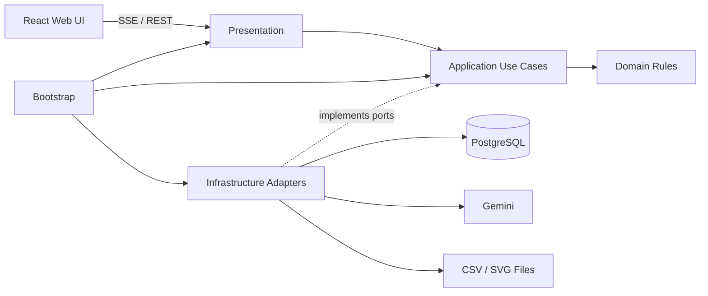

# EdgeMind — 邊緣設備診斷與溫度預測

EdgeMind 是一套面向工業馬達與邊緣設備的 AI 診斷系統。它整合感測資料、30 分鐘溫度預測、模型評估圖表與 Gemini Agent，將設備數據轉換為可讀的風險說明與維護建議。

> 數值模型負責計算預測，Gemini Agent 負責理解問題、選擇工具與整理回答；Agent 不會自行猜測設備數據。

## 文件導覽

- [主要功能](#主要功能)
- [快速啟動](#快速啟動)
- [使用方式](#使用方式)
- [系統架構](#系統架構)
- [預測模型](#預測模型)
- [推論報表與圖表](#推論報表與圖表)
- [API 參考](#api-參考)
- [開發與測試](#開發與測試)
- [部署與維運](#部署與維運)
- [常見問題](#常見問題)

## 主要功能

- 查詢設備最新溫度、濕度、XYZ 三軸加速度與震動狀態。
- 使用五項感測特徵預測 30 分鐘後的設備溫度。
- 在設備診斷聊天中選擇 `Direct Ridge` 或使用最近 60 分鐘特徵摘要的 `Ridge + History`。
- 支援以 A 設備訓練模型，再用該模型推論 B 設備。
- 提供 MAE、MSE、RMSE、R²、MAPE 與誤差中位數等回歸指標。
- 提供混淆矩陣、Precision、Recall、Specificity、F1、ROC-AUC 與 PR-AUC 等異常偵測指標。
- 彙整多次推論的平均值、中位數、標準差與 P90／P95／P99 效能。
- 後端產生 CSV 與 SVG 圖表，並透過 REST 或 SSE 將圖片附件交給前端顯示。
- 內建互相分離的 `DEMO-1` 訓練資料與 `DEMO-2` 推論資料，可快速驗證完整流程。

## 技術組成

| 分層 | 技術 |
| --- | --- |
| Web UI | React 19、Vite 8、React Markdown、Lucide React |
| API | Python 3.11、FastAPI、Pydantic、Uvicorn |
| Agent | Google Gemini、Google Gen AI SDK |
| 資料庫 | PostgreSQL 16、SQLAlchemy |
| 預測 | Python 標準函式庫實作的 Ridge Regression |
| 部署 | Docker、Docker Compose |

後端直接依賴已在 [`backend/requirements.txt`](./backend/requirements.txt) 使用 `==` 精確鎖定；前端直接與間接依賴由 [`frontend/package-lock.json`](./frontend/package-lock.json) 鎖定，確保不同環境重建時取得一致版本。

## 快速啟動

### 1. 準備環境

需要以下工具：

- Git
- 有效的 Gemini API Key
- [Docker Desktop](https://docs.docker.com/desktop/)，或 [Docker Engine](https://docs.docker.com/engine/install/) 搭配 [Docker Compose Plugin](https://docs.docker.com/compose/install/)

確認 Docker 可用：

```bash
docker --version
docker compose version
```

### 2. 取得專案

```bash
git clone https://github.com/programmerKB/Edge-mind.git
cd Edge-mind
```

### 3. 建立環境設定

在專案根目錄建立 `.env`：

```dotenv
GEMINI_API_KEY=你的_Gemini_API_Key
GEMINI_MODEL_ID=gemini-3.1-flash-lite
GEMINI_FALLBACK_MODEL_ID=gemini-3-flash-preview

POSTGRES_USER=agent_user
POSTGRES_PASSWORD=請改成高強度密碼
POSTGRES_DB=motor_monitor_db
DATABASE_URL=postgresql://agent_user:請改成高強度密碼@db:5432/motor_monitor_db

# 展示環境使用 true；正式環境應改成 false
SEED_DEMO_DATA=true

# 推論輸出與異常判定
INFERENCE_OUTPUT_DIR=/app/outputs
REPORT_TIMEZONE_OFFSET_HOURS=8
ANOMALY_TEMPERATURE_THRESHOLD=35.0

# Gemini 單次回應最長等待秒數；主模型忙碌時會有限重試並切換備援模型
AGENT_RESPONSE_TIMEOUT_SECONDS=60

# 多個來源用逗號分隔；正式環境不要使用 *
CORS_ORIGINS=*
```

`POSTGRES_PASSWORD` 必須與 `DATABASE_URL` 中的密碼一致。`.env` 已被 Git 忽略，請勿提交真實 API Key 或密碼。

### 4. 啟動服務

```bash
docker compose up -d --build
docker compose ps
```

服務入口：

- Web UI：<http://localhost:5173>
- Swagger API：<http://localhost:8000/docs>
- Backend：<http://localhost:8000>

開發模式的 PostgreSQL `5432` 與後端 `8000` 只綁定主機的 `127.0.0.1`；前端 `5173` 保持對外綁定，方便 Windows 主機或區域網路裝置連入 VM，並由前端代理 `/api` 請求。

若服務未正常啟動：

```bash
docker compose logs --tail=100 backend
docker compose logs --tail=100 frontend
```

## 使用方式

### Web UI

開啟 <http://localhost:5173>。設備問答可直接輸入：

```text
請使用 DEMO-1 訓練的模型，推論 DEMO-2 在 30 分鐘後的溫度，並說明模型誤差
```

後端會執行確定性的預測工具，先透過 SSE 回傳執行狀態與 SVG 圖表附件，再由 Gemini 根據真實工具結果整理繁體中文說明。

設備診斷頁上方的「溫度推論」可選擇 `Direct Ridge` 或 `Ridge + History`；此選擇會隨聊天請求送到後端，並強制套用在 Agent 的溫度預測工具。

### REST API

先訓練模型：

```bash
curl -X POST http://127.0.0.1:8000/api/predictions/train/DEMO-1
```

再使用 `DEMO-1` 模型推論 `DEMO-2`：

```bash
curl 'http://127.0.0.1:8000/api/predictions/temperature/DEMO-2?training_motor_id=DEMO-1&auto_train=false'
```

第一次啟動時，系統會建立兩個不重複寫入的合成資料集：

- `DEMO-1`：120 筆、每 5 分鐘一筆，供模型訓練與比較。
- `DEMO-2`：120 筆獨立資料，可做推論與零樣本外部評估，不會被加入訓練資料。

這些資料只用於確認流程，不代表真實設備表現。正式環境請設定 `SEED_DEMO_DATA=false`。

## 系統架構



後端不是只依資料夾分類，而是以 application-owned ports 保持單向依賴：

```text
presentation ─→ application ─→ domain
                       ↑
infrastructure ────────┘

bootstrap 是唯一可以同時組裝所有層的 composition root
```

| 分層 | 責任 | 禁止事項 |
| --- | --- | --- |
| `domain` | 感測實體、Ridge 計算、評估指標、DEMO 規則 | 不可匯入 FastAPI、SQLAlchemy、Gemini 或檔案系統 |
| `application` | Forecast、Sensor、Agent use cases 與抽象 ports | 不可直接匯入 infrastructure 或 presentation |
| `infrastructure` | SQLAlchemy repository／UoW、Gemini adapter、CSV／SVG 報表 | 不可匯入 presentation |
| `presentation` | Pydantic schema、FastAPI route、SSE 編碼 | 不可直接操作 SQLAlchemy、Gemini 或報表檔案 |
| `bootstrap` | 建立並注入所有具體實作 | 不放商業規則 |

`tests/test_architecture.py` 會解析所有 Python import；若未來有人讓 domain 反向依賴 FastAPI，或讓 presentation 直接存取 SQLAlchemy，測試會立即失敗。舊的頂層 compatibility facade 已全部移除，避免新舊入口並存而繼續模糊責任。

### 專案結構

```text
.
├── backend/
│   ├── main.py                 # 只公開 ASGI app
│   ├── edgemind/
│   │   ├── bootstrap.py        # Composition root 與依賴注入
│   │   ├── domain/
│   │   │   ├── entities.py     # Framework-independent 感測實體
│   │   │   ├── forecasting.py  # 純 Ridge 計算與特徵配對
│   │   │   ├── evaluation.py   # 回歸、分類與描述統計
│   │   │   └── demo_data.py    # 可重現的展示資料規則
│   │   ├── application/
│   │   │   ├── ports.py        # Repository、UoW、報表與模型抽象
│   │   │   ├── forecasts.py    # 訓練／推論 use cases
│   │   │   ├── ridge_forecasts.py # 聊天共用的 Ridge 歷史推論與報表
│   │   │   ├── sensors.py      # 感測寫入／查詢 use cases
│   │   │   ├── diagnostics.py  # Agent 可呼叫的診斷工具
│   │   │   ├── agent.py        # Transport-neutral Agent orchestration
│   │   │   └── intent.py       # 確定性預測意圖解析
│   │   ├── infrastructure/
│   │   │   ├── config.py       # 型別化環境設定
│   │   │   ├── persistence/    # SQLAlchemy models、repositories、UoW
│   │   │   ├── reporting/      # CSV、SVG、效能彙整與安全附件
│   │   │   ├── ai/             # Google Gemini gateway
│   │   │   └── runtime.py      # DB 初始化、DEMO seeding、資源釋放
│   │   └── presentation/
│   │       ├── schemas.py       # Pydantic HTTP 契約
│   │       ├── sse.py           # SSE transport encoder
│   │       └── api/             # FastAPI router 與 feature routes
│   ├── requirements.txt        # 精確鎖定的 Python 直接依賴
│   └── tests/
│       └── test_architecture.py # 自動守住各層 import 邊界
├── frontend/
│   ├── src/
│   │   ├── components/         # 可重用 UI 元件
│   │   ├── hooks/              # 聊天狀態與請求生命週期
│   │   ├── models/             # 訊息與附件正規化
│   │   └── services/           # SSE API 與增量資料解析
│   ├── package.json
│   └── package-lock.json
├── docker-compose.yml
└── README.md
```

### 資源生命週期

- FastAPI 啟動時初始化資料表並視設定載入展示資料；Gemini client 在第一次需要時建立。
- 每個 REST API 與 Agent 工具建立獨立 Unit of Work；其中 repositories 共用同一 transaction，結束後關閉 session，失敗時 rollback。
- 關閉應用時釋放 Gemini SDK client 與 SQLAlchemy connection pool。
- 每次推論建立獨立、不可覆寫的輸出目錄。
- React hook 管理 `AbortController`；停止回應、開始新對話或卸載元件時會中止過期請求。

## 預測模型

EdgeMind 為每個訓練設備保存獨立模型，避免不同機台的負載、環境與振動特性互相干擾。

| 項目 | 設計 |
| --- | --- |
| 輸入特徵 | 溫度、濕度、加速度 X、Y、Z |
| 預測目標 | 30 分鐘後溫度 |
| 模型 | Ridge Regression（L2 正則化線性回歸） |
| 最少資料 | 12 組有效的「當下 → 30 分鐘後」配對 |
| 時間容許 | 尋找最接近 30 分鐘後的紀錄，容許 ±5 分鐘 |
| 驗證方式 | 依時間排序，最後 20% 作為驗證資料 |
| 回歸指標 | MAE、誤差中位數、MSE、RMSE、R²、MAPE、平均誤差、最大誤差 |
| 異常指標 | Confusion Matrix、Accuracy、Precision、Recall、Specificity、F1、ROC-AUC、PR-AUC |
| 模型保存 | JSON 儲存於 PostgreSQL |

計算形式：

```text
預測溫度(t + 30 分鐘) = 截距 + Σ（特徵權重 × 標準化特徵）
```

訓練流程：

1. 依設備與時間排序歷史資料。
2. 以當下五項感測值建立輸入特徵。
3. 以最接近 30 分鐘後的真實溫度建立標籤。
4. 標準化特徵並訓練 Ridge Regression。
5. 使用時間序列尾端資料驗證，避免未來資料洩漏。
6. 使用完整有效資料重新訓練並保存模型。
7. 使用指定推論設備的最新完整資料產生預測。

常用指標解讀：

- **MAE**：平均誤差約為多少 °C；越低通常越好。
- **RMSE**：對少數大誤差給予較高懲罰；越低通常越好。
- **R²**：相對於只使用平均值所能解釋的變異，可能為負值。
- **MAPE**：相對誤差百分比；真值為零的樣本不納入計算。
- **Precision／Recall／F1**：衡量異常告警可信度、涵蓋率與兩者平衡。
- **PR-AUC**：類別不平衡時通常比 Accuracy 更有參考價值。

合成資料上的低誤差不等於真實設備準確度。上線前必須使用每台設備的真實歷史資料重新訓練與驗證。

### 聊天推論模型

| 模型 | 輸入 |
| --- | --- |
| Direct Ridge | 預測起點當下的溫度、濕度、X／Y／Z，共 5 項 |
| Ridge + History | 最近 60 分鐘各感測項目的現值、均值、標準差、最小值、最大值、變化量與斜率，共 35 項 |

在設備診斷頁上方選擇模型後，即可用聊天執行預測。`Ridge + History` 保留依時間做 60%／20%／20% 訓練、驗證、測試切分的流程；切分間保留 30 分鐘 purge gap，並使用驗證集從 `0.01`、`0.1`、`1.0` 選擇 Ridge α。

## 推論報表與圖表

設備診斷聊天的 `Direct Ridge`、`Ridge + History`，每次推論都會依設定時區建立獨立輸出資料夾，包含五份 CSV、七張 SVG 與 JSON 摘要：

```text
backend/outputs/
├── datasets/
│   ├── training/DEMO-1.csv
│   └── inference/DEMO-2.csv
├── inference_runs/YYYY-MM-DD/HH-MM-SS-ffffff_DEMO-2/
│   ├── csv/
│   │   ├── predictions.csv
│   │   ├── metrics_summary.csv
│   │   ├── baseline_comparison.csv
│   │   ├── anomaly_detection.csv
│   │   └── system_performance.csv
│   ├── charts/
│   │   ├── 01_actual_vs_predicted.svg
│   │   ├── 02_error_curve.svg
│   │   ├── 03_error_distribution.svg
│   │   ├── 04_baseline_mae.svg
│   │   ├── 05_anomaly_f1.svg
│   │   ├── 06_error_metrics.svg
│   │   └── 07_system_performance.svg
│   └── metadata/run_summary.json
├── performance/
│   ├── performance_history.csv
│   ├── performance_summary.csv
│   └── performance_summary.json
└── latest_run.txt
```

CSV 使用帶 BOM 的 UTF-8，可直接用 Excel 開啟。已有 30 分鐘後真值的資料會標示為 `歷史回測_已取得真值`；最新預測尚未到達目標時間時，真值保持空白並標示為 `即時推論_等待真值`。

REST 預測回應會包含 `attachments`；聊天流程則以 `status: "artifacts"` 的 SSE 事件傳送相同附件。附件只傳安全的後端 URL，不傳 base64，前端收到後即可顯示 SVG。

聊天中的報表圖表可點擊開啟完整尺寸。CSV 與 JSON 會記錄實際模型名稱，History 報表使用同一次訓練得到的 35 特徵模型與完整歷史視窗，不會套用五特徵模型的預測。

推論圖表呈現完整模型在預測設備歷史資料上的回測，同設備回測會包含訓練資料；這與鎖定測試集評估不同。`Ridge + History` 工具結果及 JSON 的模型資訊另保留原本的 `validation_metrics`、`test_metrics`，最新預測尚無真值時不計入回測指標。若只有足夠預測的歷史視窗、尚無可回測的真值，仍輸出報表，回歸指標留空並顯示無已完成觀測的圖表。

系統會記錄 Training、Inference 時間與資源量測，再以所有已完成執行計算平均值、中位數、標準差、最小值、最大值及 P90／P95／P99。相同執行重複完成時會更新原紀錄，不會增加虛假的樣本數。

## API 參考

| 方法 | 路徑 | 用途 |
| --- | --- | --- |
| GET | `/api/health` | 檢查 API 與感測資料庫是否就緒 |
| POST | `/api/chat_utf8` | Gemini Agent SSE 聊天 |
| POST | `/api/sensor-readings` | 寫入完整感測資料 |
| POST | `/api/predictions/train/{motor_id}` | 訓練並保存設備模型 |
| GET | `/api/predictions/temperature/{motor_id}` | 預測 30 分鐘後溫度；可指定 `training_motor_id` |
| GET | `/api/performance/summary` | 取得跨執行效能統計 |
| GET | `/api/report-artifacts/{path}` | 讀取預測附件中的 SVG 圖表 |

完整 request／response schema 請查看 <http://localhost:8000/docs>。

### 寫入感測資料

```bash
curl -X POST http://127.0.0.1:8000/api/sensor-readings \
  -H "Content-Type: application/json" \
  -d '{
    "motor_id": "M1",
    "temperature": 43.2,
    "humidity": 56.8,
    "accel_x": 0.12,
    "accel_y": -0.04,
    "accel_z": 1.01,
    "recorded_at": "2026-08-09T10:00:00+08:00",
    "status": "normal"
  }'
```

`motor_id`、溫度、濕度與三軸加速度為必填；所有數字都必須是有限值。`recorded_at` 未提供時由資料庫建立時間，`status` 預設為 `normal`。

## 開發與測試

### 後端

Docker 與 Python 虛擬環境是兩種不同的執行方式，**不需要同時準備**：

| 執行方式 | 適用情境 | 需要準備 |
| --- | --- | --- |
| Docker（建議） | 啟動完整的前端、後端與 PostgreSQL | Docker 與 Docker Compose；不需要在主機建立 `.venv` |
| 主機上的 Python 虛擬環境 | 單獨開發、測試或除錯後端 | Python 3.11、`.venv`，以及可連線的 PostgreSQL |

Docker 映像會直接把 Python 套件安裝在隔離的容器內，因此使用上方「快速啟動」流程時，不必另外建立虛擬環境。若 IDE 需要在主機上解析套件，或要直接從主機執行後端，才需要建立 `.venv`；兩者可以共存，但不是必要條件。

若要直接在主機開發，請將 `DATABASE_URL` 的主機改為 `127.0.0.1`，再執行：

```bash
cd backend
python3.11 -m venv .venv
source .venv/bin/activate
python -m pip install -r requirements.txt
python -m uvicorn main:app --reload
```

在已啟用的 `.venv` 中執行測試與語法檢查：

```bash
cd backend
python -m unittest discover -s tests -v
PYTHONPYCACHEPREFIX=/tmp/edgemind-pycache python -m compileall -q .
```

若使用 Docker，則可在後端容器中執行測試：

```bash
docker compose exec backend python -m unittest discover -s tests -v
```

### 前端

```bash
cd frontend
npm ci
npm run lint
npm run build
npm run dev
```

### 更新依賴

- 後端更新套件時，修改 `backend/requirements.txt` 中的精確版本後重新建置映像並執行後端測試。
- 前端修改 `package.json` 後執行 `npm install`，一併提交更新後的 `package-lock.json`。
- 不要只在本機安裝新套件而未更新依賴檔案。

## 部署與維運

### 使用 Docker Compose 正式部署

正式模式使用非 root Nginx 提供靜態前端、以非 root 且不含 `--reload` 的 Uvicorn 執行 FastAPI，並為 PostgreSQL 與後端設定健康檢查。PostgreSQL 不會公開主機連接埠，後端預設只綁定主機的 `127.0.0.1:8000`。

第一次部署前，建立環境設定：

```bash
cp .env.example .env
# 編輯 .env，填入 Gemini API Key、資料庫密碼，
# 並確認 DATABASE_URL 使用相同密碼與 db:5432。
```

先確認 Compose 設定正確：

```bash
docker compose --profile production config --quiet
```

開發與正式模式會使用相同的主機連接埠，因此切換模式前先停止目前的容器。這個指令會保留 PostgreSQL named volume 與 `backend/outputs`：

```bash
docker compose --profile production down
```

建置並啟動正式環境：

```bash
docker compose --profile production up -d \
  --build \
  --remove-orphans \
  db-prod backend-prod frontend-prod
```

必須明確列出這三個 production 服務；若省略服務名稱，Compose 也會選入預設的開發服務，造成主機連接埠衝突。

開發與正式 PostgreSQL 分別使用 `postgres_dev_data` 與 `postgres_prod_data`，不會掛載同一份資料目錄。若專案曾使用舊版共用的 `postgres_data`，請先依下方「舊版資料 volume 遷移」完成遷移，再啟動更新後的服務。

檢查容器與服務健康狀態：

```bash
docker compose --profile production ps
curl --fail http://127.0.0.1:8000/api/health
curl --fail http://127.0.0.1:5173/api/health
```

兩個健康檢查正常時都會回傳 `{"status":"ok"}`。Web UI 預設位於 <http://localhost:5173>；可在 `.env` 以 `APP_PORT` 與 `BACKEND_PORT` 修改主機端連接埠，修改後也要將上述檢查網址換成對應的連接埠。

正式環境的常用維運指令：

```bash
# 查看日誌
docker compose --profile production logs --tail=200 --follow \
  db-prod backend-prod frontend-prod

# 重新建置並套用前後端程式
docker compose --profile production up -d --build \
  backend-prod frontend-prod

# 重啟前後端
docker compose --profile production restart backend-prod frontend-prod

# 停止服務並保留資料
docker compose --profile production down
```

若要切回開發模式，停止正式環境後啟動預設服務：

```bash
docker compose --profile production down
docker compose up -d --build
```

### 區域網路存取

Production 的 Nginx（開發模式則為 Vite）會將 `/api` 代理到後端。區域網路裝置可直接開啟：

```text
http://192.168.1.50:5173
```

請換成部署主機 IP，並允許 TCP 5173。只有前端與 API 位於不同來源時，才需要建立 `frontend/.env.local`：

```dotenv
VITE_API_URL=http://192.168.1.50:8000/api/chat_utf8
```

這種分離部署模式也必須允許 API 連接埠。行動裝置中的 `127.0.0.1` 指向裝置本身，不是部署主機。

### 查看資料庫

開發模式：

```bash
docker compose exec db psql -U agent_user -d motor_monitor_db
```

正式模式：

```bash
docker compose --profile production exec db-prod \
  psql -U agent_user -d motor_monitor_db
```

```sql
SELECT
    motor_id,
    COUNT(*) AS reading_count,
    MIN(recorded_at) AS first_record,
    MAX(recorded_at) AS latest_record
FROM motor_sensor_data
GROUP BY motor_id
ORDER BY motor_id;
```

輸入 `\q` 離開 PostgreSQL。

### 舊版資料 volume 遷移

只有從仍使用 `postgres_data` 的舊版設定升級時才需要執行一次。先停止服務，以唯讀方式掛載舊 volume，並將內容複製到新的開發 volume：

```bash
docker compose down
docker compose create db
docker run --rm \
  --mount type=volume,src=my_agent_project_postgres_data,dst=/source,readonly \
  --mount type=volume,src=my_agent_project_postgres_dev_data,dst=/target \
  alpine:3.24@sha256:28bd5fe8b56d1bd048e5babf5b10710ebe0bae67db86916198a6eec434943f8b \
  sh -c 'cp -a /source/. /target/'
docker compose up -d --build
```

確認開發資料完整後，再自行移除舊的 `my_agent_project_postgres_data`。不要把舊 volume 複製到 `postgres_prod_data` 當作正式資料；正式資料應從經過確認的備份還原。

### 備份與還原

備份：

```bash
docker compose --profile production exec -T db-prod \
  pg_dump -U agent_user motor_monitor_db > motor_monitor_backup.sql
```

還原：

```bash
docker compose --profile production exec -T db-prod \
  psql -U agent_user -d motor_monitor_db < motor_monitor_backup.sql
```

`docker compose --profile production down` 不會刪除 PostgreSQL volume。不要加上 `-v` 當成一般重啟；`docker compose down -v` 會刪除開發與正式環境各自的資料庫 volume。

### 正式部署基線

目前 Compose 適合開發、展示與可信任內網。公開部署前至少應：

- 設定 `SEED_DEMO_DATA=false`。
- 將 CORS 限制為實際前端網域。
- 前端使用 production build 與正式 Web Server。
- 後端停用 Uvicorn `--reload`。
- 不對外公開 PostgreSQL 5432。
- 定期更新並重新鎖定 Docker 基礎映像的版本與 digest，以取得安全修補。
- 啟用 HTTPS、登入、授權與 rate limit。
- 使用 secret manager 保存 API Key 與資料庫密碼。
- 加入健康檢查、監控、告警、自動備份與還原演練。
- 使用真實設備資料重新訓練，並制定可接受的誤差與告警門檻。

## 常見問題

### 網頁無法開啟

```bash
docker compose ps
docker compose logs --tail=100 frontend
curl -I http://127.0.0.1:5173
```

### 前端顯示「伺服器回應錯誤」或 Failed to fetch

先確認前端代理與後端都能回應：

```bash
curl -i http://127.0.0.1:5173/api/performance/summary
curl -i http://127.0.0.1:8000/api/performance/summary
```

若使用自訂 `VITE_API_URL`，確認網址可由瀏覽器所在裝置存取，且包含 `/api/chat_utf8`。HTTPS 前端也不能直接呼叫 HTTP API。

### Agent 沒有回應

```bash
docker compose logs --tail=200 backend
```

確認 `GEMINI_API_KEY` 有效、`GEMINI_MODEL_ID` 可由該帳號使用，且主機能連線 Google API。模型超過預設 60 秒未回應時會回傳錯誤，可調整 `AGENT_RESPONSE_TIMEOUT_SECONDS`。

### 資料庫連線失敗

Docker 中的後端應使用 `db:5432`；直接在主機執行後端時才使用 `127.0.0.1:5432`。

```bash
docker compose logs --tail=100 db
```

### Docker 權限不足

依作業系統設定 Docker 使用者群組，或在必要時以具備 Docker socket 權限的帳號執行。重新登入後可用 `docker ps` 驗證。

## 已知限制

- Ridge 模型假設特徵與目標近似線性，未涵蓋複雜長期序列效應。
- 新資料不會自動觸發重新訓練，需依資料量或週期呼叫訓練 API。
- 驗證指標來自單次時間切分，不等同跨季節、跨負載條件的完整驗證。
- 尚未提供使用者登入、細粒度授權、rate limit 與完整稽核機制。
- `DEMO-1` 與 `DEMO-2` 是合成資料，只能用於功能驗證。

## License

目前專案尚未加入 License。散布、商業使用或交付第三方前，請先補上授權條款。
