# EdgeMind 研究方法與實驗計畫

> 文件性質：可執行的研究規格，不是實驗結果。本文中的門檻若標為「建議初值」，必須在查看最終測試集之前，由研究者、設備工程師與目標硬體負責人共同確認並凍結。任何表格不得填入未實際量測的數字。

## 1. 研究定位

本研究將現有 EdgeMind 的「單一時間點五特徵，預測 30 分鐘後單一溫度」擴充為：

\[
X_{t-55:t}\in\mathbb{R}^{12\times5}
\rightarrow
\hat{Y}_{t+5:t+30}\in\mathbb{R}^{6}
\]

其中基本取樣週期為 5 分鐘，輸入為最近 60 分鐘的溫度、濕度與三軸加速度，輸出為未來 5、10、15、20、25、30 分鐘的溫度軌跡。預測軌跡再由確定性規則轉換為最高溫度、升溫速率、是否越過門檻、預估越界時間與 Low／Medium／High 風險；語言模型只解釋已計算的結果，不參與數值預測或真值標註。

現有 production forecast 是重要的可重現 baseline，不應直接刪除或以深度模型取代。Repository 目前同時保留 production 與研究工作台：

- Production-compatible path 已實作：Persistence、temperature-only Ridge、five-feature Ridge 回測；推論仍是最新單點 five-feature Ridge、固定 +30 分鐘、目標最近鄰容許 ±5 分鐘。評估取最後 20% validation，並 purge target time 未嚴格早於第一個 validation origin 的訓練樣本；它仍沒有獨立 locked test。
- Research workbench 已實作：精確 5 分鐘對齊的 12×5 history、+5…+30 分鐘 direct multi-horizon、60/20/20 與 6-step gaps、3-fold walk-forward runtime default、Direct Ridge／Ridge + History、feature ablation、軌跡與事件風險、逐樣本／split ledger、paired device-day block bootstrap CI 與 JSON／CSV artifacts。
- Research optional adapters 已實作：DLinear、LSTM、TCN、PatchTST；Compose 預設安裝 CPU-only `backend/requirements-research.txt`，資源受限 image 才明確 override 為只含兩個 Ridge 模型的 `requirements.txt`。
- Current forecast path 已實作：`POST /api/research/forecasts` 先以 chronological train／validation／locked-test 和 purge gap 計算歷史誤差，再以全部已知標籤重訓，對最新精確 12-step history 產生六點 pending-truth 軌跡、風險、三張圖、資料指紋與 leakage audit；前端與 Agent 均可觸發，歷史誤差與尚未發生的即時真值保持語意隔離。
- 歷史 actual-vs-predicted 圖固定使用 request 中最遠 horizon，沿時間顯示 locked test 最近最多 60 個已觀測樣本；不能只拿最後一條 trajectory，否則單一 horizon 請求會退化成無法辨識的一個點。
- Runtime v2 已完成：Ridge development-only alpha grid、四個 PyTorch 模型 validation MAE early stopping、最佳 epoch 凍結後 development refit，以及相對 Direct Ridge 的 locked-test skill score。尚未成為一鍵正式論文 pipeline的部分是：多 seed orchestration、完整架構超參數 trial budget、自動 Holm orchestration與真正 target-hardware energy benchmark。
- `DEMO-1`／`DEMO-2` 是流程測試資料，不能用來主張真實設備準確度或模型優越性。

目前 optional adapters 採固定研究 seed 與受控小型架構，並已套用 validation early stopping；在補齊一致的架構搜尋 trial budget與五個 seeds 之前，單次 run 仍只能視為探索性結果，不能宣稱某架構普遍優於另一架構。

### 1.1 研究目標

1. 衡量歷史序列相對單點輸入是否改善未來溫度軌跡預測。
2. 在相同資料、切分、調參預算與硬體下，比較 Ridge、線性序列、循環網路、卷積序列與 patch-based 模型。
3. 驗證濕度、振動與歷史趨勢各自提供的增益。
4. 找出預測誤差與維護提前量之間可接受的 horizon。
5. 檢驗同設備與跨設備泛化，避免只在單一馬達上得到結論。
6. 同時量測預測品質與 edge 成本，選擇 Pareto-efficient 模型，而非只挑最低 MAE。
7. 評估溫度軌跡轉換成過熱預警後的偵測能力與實際 lead time。

### 1.2 v2 可執行研究流程

```mermaid
flowchart LR
    A[不可變 raw + provenance] --> B[品質檢核與精確 5 分鐘格點]
    B --> C[先凍結時間 split 與兩段 purge gap]
    C --> D[建立共同 12×5 → 6 horizon windows]
    D --> E[development-only 選 alpha / trees / epochs]
    E --> F[凍結設定並以完整 development refit]
    F --> G[locked test 一次評估]
    G --> H[MAE/RMSE/R²/skill + event + block CI]
    H --> I[跨設備與 edge gate]
    I --> J[人工安全審查後才可 promotion]
```



每個狀態都有 fail-closed 條件：資料不足仍可跑 E0，但不得升格為正式證據；候選模型失敗保留原因；test 解封後不得回到 tuning；合成資料永遠保持 `research_claims_allowed=false`；準確率達標但跨設備、安全事件或 edge gate 未過，也不得部署為 champion。

## 2. 研究問題與預先假設

假設是待檢驗敘述，不代表預期一定成立。方向性假設與主要指標應在最終測試集解封前凍結。

| 編號 | 研究問題 | 預先假設 | 主要比較與指標 |
| --- | --- | --- | --- |
| RQ1 | 歷史序列是否優於單點輸入？ | H1：Ridge + History 的 test MAE 低於現有 five-feature Ridge | paired MAE 差與 95% CI |
| RQ2 | 哪一類模型最適合溫度軌跡？ | H2：至少一個歷史／序列模型優於 Direct Ridge，但未預設 LSTM 必勝 | 全 horizon macro MAE；Holm 校正後比較 |
| RQ3 | 哪些感測特徵真正有用？ | H3：歷史溫度趨勢有穩定增益；濕度與加速度的增益需由 ablation 決定 | 相對全特徵模型的 MAE、PR-AUC 變化 |
| RQ4 | 最多能提前多久可信預警？ | H4：horizon 越長誤差通常越高；30 分鐘是否值得採用由精度與 lead time 共同決定 | +5…+30 分鐘逐 horizon MAE、event lead time |
| RQ5 | 模型能否跨設備使用？ | H5：zero-shot 跨設備表現低於同設備模型；有限校正可縮小差距 | leave-one-device-out macro MAE／PR-AUC |
| RQ6 | 準確率增益是否值得 edge 成本？ | H6：最佳準確模型未必是最佳部署模型 | MAE、p95 latency、peak RAM、artifact size Pareto front |
| RQ7 | 軌跡式預測能否形成有效預警？ | H7：預測軌跡相較「目前溫度門檻」提高事件 recall 或 lead time，且不使誤報超出預設上限 | event recall、precision、false alarms/day、lead time |

## 3. 任務、標籤與風險定義

### 3.1 主要 forecasting 任務

- Sampling interval \(\Delta=5\) 分鐘。
- History length \(L=12\)，涵蓋 `t-55, ..., t` 共 60 分鐘。
- Primary horizon \(H=6\)，同時預測 `t+5, ..., t+30`。
- 核心輸入：`temperature`, `humidity`, `accel_x`, `accel_y`, `accel_z`。
- 評估輸出：六個絕對溫度值。所有模型訓練 `ΔT_h=T(t+h)-T(t)`，推論再加回 `T(t)`；這降低跨時間位準漂移，評分公式與 °C 真值完全不變。測試期真值、未來狀態或人工 `status` 不進入輸入。
- +60 分鐘是第二階段敏感度實驗，必須另建 12-step label，不可用外插方式假裝成模型輸出。

以 origin time \(t\) 建立一個樣本：

```text
input  = [t-55, t-50, ..., t]       # 12 rows
target = [t+5,  t+10, ..., t+30]    # 6 rows
```

主實驗使用重新取樣後的精確格點，不延續目前單點程式的 ±5 分鐘目標最近鄰規則。最近鄰規則只保留在「Legacy Ridge」baseline，並額外報告 strict-grid Ridge，才能區分模型改善與樣本建構方式改變。

### 3.2 衍生維護輸出

從每一條六點預測軌跡計算：

- `predicted_max_temperature_c`：六點最大值。
- `threshold_crossing`：是否至少一點達到 `critical_temperature_c`。
- `time_to_threshold_minutes`：第一個達到 critical 門檻的 horizon；未越界則為 `null`，不可寫成 0。
- `heating_rate_c_per_min`：以 origin 當下溫度與六個 forecast points 做線性斜率；另保留 `max_adjacent_heating_rate_c_per_minute`。把 origin 納入是目前 prototype 的明示定義，讓突升發生在第一個 +5 點時不會被忽略。
- `risk_level`：由版本化、可稽核的規則產生。

建議初始風險規則如下；實際溫度與升溫率門檻必須依馬達規格、感測器位置與安全審查設定，現有 `35°C` 僅為部署設定預設值，不能自動視為科學或安全標準。

目前 research workbench 的可執行 prototype 使用單一 `threshold_c=35.0`、`medium_risk_margin_c=2.0`、`rapid_heating_c_per_minute=0.10`：預測跨 threshold 為 High，距 threshold 2°C 內或升溫率達門檻為 Medium，其餘為 Low。這些都是軟體預設，不是設備安全規格。下列 formal policy 將 warning 與 critical 分開版本化；實作該政策前，報告必須顯示目前使用的 prototype 參數。

```text
High   : predicted max >= critical threshold，或預計 <= critical_lead_minutes 越界
Medium : predicted max >= warning threshold，或 heating rate >= rapid_rise threshold
Low    : 其餘情況
```

分類真值由同一 horizon 的實測溫度軌跡套用同一規則產生。人工 `status` 欄位可做事後分層分析，但不是 overheat 真值，以避免主觀標註或由目前溫度直接造成 label leakage。

### 3.3 事件層級定義

連續超過 critical 門檻的格點合併成一個 overheat event；兩次越界若相隔小於設定的 `event_merge_gap_minutes` 仍視為同一事件。一次預警只配對其後第一個尚未配對的事件。事件開始前 `warning_lookback_minutes` 內發出的預警才算 true positive；沒有後續事件的預警計為 false alarm。這個定義需在測試前凍結，避免用逐視窗樣本數灌大分類成績。

Origin time 已經 `T_t >= critical` 的 window 屬於「ongoing event detection」，不能算成提前預警 true positive 或取得 0 分鐘 lead time 後與 pre-event windows 混合。主要 early-warning cohort 只包含 origin 尚未越界的 windows；ongoing cohort 另報偵測率。現有 workbench 已另外執行 event matcher：合併短間隔事件、把連續 warning 收斂成 episode、排除 ongoing 與邊界 censored evidence，並報 event precision／recall、false alarms per observed day 與成功 lead time；window-level confusion matrix 仍與它分開。

## 4. 模型矩陣

所有「主要比較」模型使用同一批合格 window、相同五個核心原始特徵與六個輸出 horizon。無法原生多輸出的模型，以每個 horizon 一個 estimator 實作；不得讓某模型額外看到測試資訊。

| ID | 模型 | 輸入表示 | 多 horizon 作法 | 研究角色 |
| --- | --- | --- | --- | --- |
| M0 | Direct Ridge (`ridge_direct`) | `t` 的五特徵 | 每 horizon 一個 Ridge | 單點輸入 baseline |
| M1 | Ridge + History/Trend (`ridge_history_trend`) | 12×5 flatten，加上只由 history 算出的 slope／mean／std／min／max | 每 horizon 一個 Ridge | 可解釋歷史 baseline |
| M2 | DLinear (`dlinear`) | decomposition 後的 12×5 sequence | per-feature linear + 6-output projection | 簡單線性 sequence baseline |
| M3 | LSTM (`lstm`) | 標準化 12×5 sequence | shared encoder + 6-output head | canonical recurrent comparator |
| M4 | TCN (`tcn`) | causal dilated 1D convolution | 6-output head | 並行、edge-friendly sequence comparator |
| M5 | PatchTST (`patchtst`) | channel-independent length-4 patches | 2-layer encoder + 6-output head | patch-based comparator |

六種模型均已具可執行 adapter，但正式研究仍應設資料與資源 gate；未通過 gate 時可保留 `unavailable`／不執行，且不可將缺席解讀為較差。

目前 executable adapters 是受控 prototype：LSTM 使用單層 32-unit encoder；TCN 使用 dilation 1／2／4 的 causal Conv1d；DLinear 使用 moving-average trend/seasonal decomposition；PatchTST 使用 channel-independent length-4 patches與兩層 encoder。PyTorch 模型以各 horizon 等權 MAE（L1）訓練，預設最多 160 epochs、patience 16、batch 128；最佳 epoch 只由 validation 決定。正式比較仍須補齊一致的 architecture search budget 與多 seed protocol。

### 4.1 建議的受控搜尋空間

搜尋空間應在實驗開始前寫入 config。所有需要調參的模型使用相同的 trial 數或明確報告不同成本。

| 模型 | 搜尋參數（建議初值） |
| --- | --- |
| Ridge | `alpha ∈ {1e-4, 1e-3, 1e-2, 1e-1, 1, 10}` |
| LSTM | 1–2 layers、hidden 16/32/64/128、dropout 0–0.3、learning rate 1e-4–3e-3、batch 32/64/128 |
| TCN | channels 16/32/64、kernel 2/3/5、dilation blocks 2–4、dropout 0–0.3 |
| DLinear | moving-average kernel 3/5/7、individual/shared linear heads |
| PatchTST | patch length 3/4/6、stride 1/2/3、d_model 32/64、heads 2/4；所有模型 trial 預算一致 |

神經模型用 validation MAE early stopping，保存最佳 epoch；最大 epoch、patience 與 batch size 一併記錄。預設損失為各 horizon 等權 MAE；若改用加權 loss，必須另列實驗且在看 test 前決定權重。

## 5. 實驗組別

### E0：資料與 pipeline smoke test

- 使用各 7 天／2,016 筆的 `DEMO-1`／`DEMO-2` 驗證 ingest、window shape、train、serialize、load、predict、report。
- 驗證輸入 shape 為 `(batch, 12, 5)`，輸出 shape 為 `(batch, 6)`。
- 故意放入邊界缺值、重複時間、亂序與跨 split window，確認會被拒絕或按規則處理。
- E0 的任何準確度只能標成「合成流程測試」，不得放入主要結果或摘要。

### E1：同設備模型比較（主要實驗）

- 每個設備分別依時間切分。
- 比較 M0、M2–M10；M1 只報 +30 連續性結果。
- 主要結果為每設備先算指標，再做設備 macro average，避免資料量大的設備支配結論。
- 同時提供 pooled 指標作工程參考，但不可取代 macro 結果。

### E2：Feature ablation

固定每一模型的切分、seed 與 tuning protocol，比較：

| Ablation | 特徵 |
| --- | --- |
| A | Temperature only |
| B | Temperature + Humidity |
| C | Temperature + Acceleration XYZ |
| D | Temperature + Humidity + Acceleration XYZ |
| E | D + 只由 history 計算的 trend summaries（Ridge）；序列模型直接使用 history，另可加 summaries 做敏感度分析 |

對 acceleration 的結果需注意單位、sensor orientation 與取樣方式；若原始訊號是高頻振動，應另做「XYZ snapshot vs 5-minute vibration aggregates」實驗，不可將一個瞬時 XYZ 值當作完整振動資訊。

### E3：Forecast horizon

- 主分析逐一報告 +5、+10、+15、+20、+25、+30 分鐘。
- 論文摘要表至少列 +5、+15、+30 與六點 macro。
- 若要比較 +60，所有模型需重建相同 12-step target，並因 horizon 增加重新設定 purge gap；不可只評估能取得真值的容易樣本。
- 採用的 operational horizon 由 validation 上的精度、事件 recall、median lead time 與部署需求共同決定，不能用 test 表現反覆挑選。

### E4：跨設備泛化

1. **Personalized**：設備自己的早期資料訓練，晚期資料測試。
2. **Leave-one-device-out zero-shot（主要跨設備協定）**：保留一台外部設備的全部 sequence 作 cross-device test，完全不參與 fit／scaler／tuning；其餘開發設備才各自做 60/20/20。不可先看外部設備早期資料再把後段稱為 zero-shot test。
3. **Few-shot calibration（選配）**：只用目標設備最早的固定校正期 fine-tune，測試仍是後段未見資料；與 zero-shot 分開報告。

所有設備輪流作 held-out device 時，每一輪都要重新 fit 全部 preprocessing 與模型。系統示範資料的預設角色是 `RESEARCH-A` 作 development、`RESEARCH-B` 整台保留作 external test。若設備型號、sensor placement 或環境差異很大，結果需依 domain 分層報告。不得在全資料上先標準化，也不得用 held-out device 的均值／標準差做 zero-shot normalization。Few-shot 是另立 protocol 的次要實驗，不能取代主要 zero-shot 結果。

目前 `/api/research/experiments` 一次只接受一個 `training_motor_id` 與一個選配 `evaluation_motor_id`。它能執行一組 zero-shot pair，但不會自動完成所有 leave-one-device-out rotations 或 macro-device 統計；正式 E4 需由上層 orchestrator 逐輪呼叫、凍結相同 config，並彙整所有 held-out devices。

### E5：Edge deployment benchmark

在明確命名的目標 edge hardware 上，對已凍結 artifact 執行：

目前 workbench 已量測 training time、逐 sequence `perf_counter` inference latency、parameter count 與 JSON-serializable model state bytes。這些欄位適合早期相對比較，但沒有 warm-up／固定 governor／optimized runtime，且 state bytes 不等於 ONNX／TFLite／UBJ production artifact 大小，因此**不算完成 E5**。

- 30 次 warm-up 後至少 1,000 次單筆推論；另測 batch=1 的完整 preprocess → predict → risk latency。
- 固定 CPU governor、thread 數、runtime／量化設定、供電模式與環境溫度，記錄軟硬體版本。
- 報告 latency mean、median、p90、p95、p99，peak RSS／RAM、模型檔大小、冷啟動、CPU time。
- training time 在統一訓練硬體量測，與 edge inference latency 分開。
- 能可靠取得電力資料時才報 energy/inference；若無量測設備，明確標 `not measured`，不得用 CPU time 冒充能耗。
- 對支援的模型加做 FP32 vs INT8／動態量化；量化前後都重測準確度，不能只報加速。

### E6：風險與預警比較

比較目前溫度門檻、Direct Ridge 軌跡與其他 forecast model 衍生風險。主分析以事件為單位，另提供 window-level confusion matrix。若 test 內正事件不足，PR-AUC、recall 與 lead-time 結果只列探索性結果，不做確證結論。

## 6. 公平比較規則

模型矩陣包含兩種不同目的：M0 刻意限制為單點輸入，用來回答 history 是否有價值；M1–M5 是 model-family 主比較，全部可取得相同 12×5 raw history。各模型可使用與架構相符、已聲明的 deterministic representation，但不能額外取得不同時間範圍或 sensor。

1. 同一實驗內所有模型取得相同 sample IDs；因缺值而被排除的 window 清單存檔。
2. split manifest 在特徵處理前建立並凍結；任何 scaler、imputer、feature selector、門檻校準與資料增強只 fit training portion。
3. hyperparameter selection 只能讀 validation／inner walk-forward；test 僅在 pipeline 與分析計畫凍結後執行一次。
4. Ridge 以 validation 選 alpha；決定性模型仍以相同 test blocks bootstrap，隨機模型至少 5 個預先列出的 seeds。
5. 所有模型使用相同 loss aggregation 與 horizon weights；若某模型用不同資料或額外感測器，列為獨立擴充實驗。
6. PyTorch 模型使用 validation-based early stopping；不得以 test 最佳 epoch 報告。
7. 訓練失敗、OOM 或不收斂也需留存 run status 與原因，不可靜默刪除失敗 seed。
8. 主要模型表同時列參數量／artifact size／延遲；精度最佳與部署推薦可以是不同模型。
9. 比較報告須顯示樣本數、設備數、事件數與 coverage，不能只顯示一個平均值。

## 7. 時間切分、gap 與 walk-forward

完整資料處理見 [DATASET_PROTOCOL.md](./DATASET_PROTOCOL.md)。主要切分採每設備 chronological `60% train / 20% validation / 20% locked test`，不得 shuffle。邊界至少 purge 30 分鐘（6 個 origin steps），並移除任何 target 跨過下一 split 邊界的 window。

在前 80% development period 內執行 expanding walk-forward。系統 runtime 預設為 3 folds，適合先驗證流程；正式論文若資料量足夠，建議在解封 test 前將 protocol override 預註冊為 5 folds。3-fold 主分析加 5-fold sensitivity 也可，但哪一個是 primary 必須事前寫明：

```text
Fold 1  train ███████      gap ······  validate ██
Fold 2  train █████████    gap ······  validate ██
Fold 3  train ███████████  gap ······  validate ██
...
Locked test                                      ████
```

`gap=6` 是 origin 間的最低 purge，防止 train label 落進 validation。由於相鄰序列仍可能共享較早的 predictor rows，另做 `strict_gap = L + H - 1 = 17 steps` 敏感度分析；若結論改變，必須揭露。對維護事件的所有 windows 必須整組留在同一 split，不能把同一事件前後的高度相似 window 分到不同集合。

## 8. 評估指標

### 8.1 回歸

- **Primary**：六個 horizon 等權 macro MAE；先在每設備／seed 算，再跨設備平均。
- Secondary：逐 horizon MAE、RMSE、median absolute error、max absolute error、R²、mean error（bias）。
- MAPE 可為現有系統相容性指標；因溫度量綱與接近零問題，研究結論不以 MAPE 單獨判定，可補 sMAPE。
- `relative_improvement_vs_ridge_direct = (MAE_ridge_direct - MAE_model) / MAE_ridge_direct`。
- 軌跡品質另報 predicted max error 與 heating-rate error。

#### R² 與舊版低分的解讀

舊版畫面不是「深度模型一定無效」，而是三個問題同時發生：36 筆只能形成 19 個嚴格序列；合成溫度近乎單調且 holdout 變異很小；學習模型直接預測絕對溫度又固定訓練 80 epochs。R² 定義為 `1-SSE/SST`，當 test 真值的 `SST` 接近零時，即使 MAE 只有零點幾度，也會出現很大的負值。負 R² 代表不如該 test 的平均值 baseline，不是程式應抹掉的異常值。

Runtime v2 同時報 `target_distribution.stddev_c`、low-variance 警告、原始 MAE／RMSE／R²，以及 `skill_score_vs_ridge_direct=1-MAE_model/MAE_ridge_direct`。不得裁切負 R²、刪除失敗模型、挑最好 seed、用 test early-stop，或調整 synthetic generator 來迎合特定模型。即使完成公平調參，某模型仍可能誠實地輸給 Direct Ridge；研究目標是每個模型在相同限制下達到自身可重現最佳，而不是讓所有分數看起來相同。

### 8.2 分類與事件

- **Primary**：event recall、event precision、false alarms per operating day、median successful lead time。
- Secondary：PR-AUC、average precision、ROC-AUC、F1、specificity、balanced accuracy、false-negative rate。
- Binary ranking score 固定為 `predicted_max_temperature_c - critical_temperature_c`；這是連續風險分數而非校準後機率，不得在 UI 稱為「故障機率」。
- Window-level Precision／Recall／PR-AUC／ROC-AUC 的主要 early-warning cohort 只納入 origin 尚未越界的樣本；origin 已越界者從主要指標排除，另報 `ongoing_origin_detection` 與樣本數，避免把 0 分鐘 ongoing detection 當成提前預警。
- Window-level threshold confusion matrix 不產生 event lead time；目前 artifact 明示 `lead_time_status=not_computed_without_event_matching`。只有完成第 3.3 節事件配對後才能報告 warning lead-time 分布。
- Low／Medium／High 另報三類 confusion matrix、macro-F1 與每類 recall；只報 overall accuracy 會掩蓋少數 High 類別。
- 門檻類別不平衡時以 PR-AUC／event recall 為主，不因 ROC-AUC 高就宣稱可用。
- Time-to-threshold 僅對實際越界事件計算 MAE；未越界樣本視為 censored，分開報 coverage，不把 `null` 當 0。

### 8.3 Edge 與系統

- 模型 artifact bytes、參數量、cold-start ms。
- 純模型 inference 與 end-to-end latency 的 p50／p95／p99。
- peak RSS、CPU time、training time；可量測時加入 energy/inference。
- 資料 freshness、missing rate、prediction coverage、連續運作時間與錯誤率。

## 9. 統計分析

1. 隨機模型固定 seeds：`[17, 29, 43, 71, 101]`；若增加 seeds，須對所有候選一致執行。
2. 以「設備 × 日期／運轉 session」為 resampling block 做 paired block bootstrap（建議 10,000 次），產生 MAE 差與相對改善的 95% percentile CI。不可把重疊 windows 當獨立樣本做一般 t-test。
3. 主要模型與 Direct Ridge、以及候選模型與 Ridge + History 做事先指定的 paired comparisons。兩模型可用 block-level permutation 或 Wilcoxon signed-rank；樣本 block 太少時只報 CI 與效果量。
4. 多模型／多 horizon p-value 以 Holm 方法校正；同時報絕對差、相對差與 CI，不只報顯著與否。
5. 神經模型先對每個 seed 取得 block 指標，再報 seed mean ± SD；bootstrap 時以配對 seed 或先聚合 seed，分析方式需寫入 run metadata。
6. Cross-device 以 held-out device 為統計單位。設備數太少時不做廣泛母體推論，結論限定於受測機群。
7. 在看 test 前指定 primary endpoint、比較對與 acceptance gates；其他分析標為 exploratory。

## 10. Acceptance gates

以下是「建議初值」，不是已達成結果。正式值要在 test 解封前寫入版本化 config。

### 10.1 Data readiness gate

- 每台設備建議至少 30 個連續運轉日、每 5 分鐘 8,640 個理論格點；研究至少涵蓋 3 台設備與多種負載。這是啟動比較的最低建議，不等同統計 power 保證。
- Workbench config 目前把 36 筆標成 pipeline-eligible、2,016 筆（7 天）標成 exploratory study-eligible；這兩個 UI 提示不等於本節的 formal readiness。正式結論仍以 30 天建議、事件數、設備數與 pilot power analysis 共同判定。
- 核心欄位有效率至少 95%，時間格點 coverage 至少 90%；低於門檻的設備不悄悄刪除，列入 exclusion report。
- 最終 test 若少於 30 個彼此可區分的過熱事件，事件結論標為 exploratory；不可用大量重疊 windows 取代事件數。
- 必須具有 calibration、sensor placement、firmware、timezone 與 operating-session metadata。

### 10.2 Scientific gate

- 候選模型相較 Direct Ridge 的 primary MAE 建議至少改善 5%，且 paired 95% CI 的改善方向不跨 0。
- 候選模型相較 Ridge + History 若無實質改善，應優先較簡單模型；「實質」建議用 validation 先凍結，例如 MAE 相對改善 3%。
- 在至少 4/5 seeds 與多數設備／fold 保持改善；若只在單一設備有效，結論限定於該設備。
- Risk gate 建議 event recall ≥ 0.90，並將 precision／false alarms per day 與 median lead time 一起達標；誤報與 lead-time 上限由維護團隊先定義。

### 10.3 Edge gate

- 建議初值：batch=1 end-to-end p95 ≤ 50 ms、artifact ≤ 10 MiB、額外 peak RAM ≤ 256 MiB、prediction coverage ≥ 99%。
- 以上數字必須依實際 MCU／gateway 能力重設；若部署目標尚未選定，報告只能做 benchmark，不能宣稱「適合 edge」。
- 任一 accuracy gate 達標但違反安全 recall 或硬體限制的模型不得自動升為 production champion。

### 10.4 Reproducibility gate

- dataset manifest hash、split hash、code commit、config、environment lock、seed、model checksum 與所有失敗 run 都可追溯。
- 從 frozen manifest 執行兩次，指標差異需符合相同 runtime 的確定性允差；無法完全 deterministic 時報 seed variation。
- Agent 產生的文字不列入預測準確度，風險判斷可在停用 Agent 時完整重現。

## 11. 可照做的實驗流程

1. 設備工程師核准感測器位置、單位、warning／critical 門檻與安全採集程序。
2. 收集真實資料並保存 immutable raw zone；用 [DATASET_PROTOCOL.md](./DATASET_PROTOCOL.md) 的 schema 驗證。
3. 產生 `dataset_manifest.json`：檔案 hash、時間範圍、設備、單位、校正版本、排除理由。
4. 先建立每設備 time split 與 gap，再 fit 任何 preprocessing；輸出 `split_manifest.parquet/csv`。
5. 由每個 split 獨立建立 strict-grid windows；儲存 `sample_id, device_id, origin_time, split` 與排除原因。
6. 跑 Direct Ridge 與 Ridge + History smoke test；確認 strict-grid 指標與輸入形狀正確。
7. 在 development period 跑 nested chronological tuning：inner train 與 validation 間仍保留 horizon gap；Ridge 選 alpha、PyTorch 選停止 epoch。每 trial 留存 config、validation 指標、時間與狀態。
8. 凍結每模型選定設定後，用 locked-test gap 之前的完整 development period（包含原 train／validation）重新初始化與擬合；scaler 也只在此範圍重算。再以五個 seeds 完成 DLinear、LSTM、TCN 與 PatchTST。
9. 執行 E2 ablation、E3 horizon、E4 leave-one-device-out；全部仍不讀 locked test。
10. 凍結 primary analysis 與 gates，對 locked test 執行一次批次推論；不得依 test 結果回到第 7 步重選設定。
11. 以 block bootstrap／paired tests 產生 CI 與校正後結果；建立 accuracy–latency–memory Pareto 圖。
12. 在目標 edge hardware 重跑 E5，並用真實軌跡執行 E6 event matching。
13. 通過 gates 才將模型標為 `candidate`；另經工程與安全審查才可 `promoted`。
14. Agent 只讀 frozen numerical result 產生說明；抽查數值、時間與建議是否忠於 payload。

## 12. 實驗設定範例

以下 YAML 可作為 `research-v1` 起點；實作者應將它放入實際 experiment runner 的版本控制位置。`TBD_BY_ENGINEER` 必須在正式 run 前替換。

```yaml
experiment:
  name: edgemind_multihorizon_v1
  protocol_version: "1.0"
  primary_metric: macro_device_mae_all_horizons
  seeds: [17, 29, 43, 71, 101]
  deterministic_algorithms: true

dataset:
  source: real_motor_sensor_data
  cadence_minutes: 5
  history_steps: 12
  horizon_steps: 6
  features: [temperature, humidity, accel_x, accel_y, accel_z]
  target: temperature
  timestamp_timezone: UTC
  max_timestamp_snap_seconds: 30
  max_predictor_forward_fill_steps: 1
  interpolate_targets: false
  minimum_feature_valid_rate: 0.95
  # These devices are wholly excluded from fit/preprocessing/tuning.
  external_test_device_ids: [TBD_EXTERNAL_DEVICE]

split:
  strategy: per_device_chronological
  train_fraction: 0.60
  validation_fraction: 0.20
  test_fraction: 0.20
  purge_gap_steps: 6
  strict_gap_sensitivity_steps: 17
  # Runtime default is 3. This research protocol deliberately overrides it;
  # use 3 when data cannot support five non-trivial validation blocks.
  walk_forward_folds: 5
  shuffle: false

models:
  required:
    - ridge_direct
    - ridge_history_trend
    - dlinear
    - lstm
    - tcn
    - patchtst
  tuning_trials_per_model: 30
  early_stopping_patience: 20
  max_epochs: 300

risk:
  warning_temperature_c: TBD_BY_ENGINEER
  critical_temperature_c: TBD_BY_ENGINEER
  rapid_rise_c_per_min: TBD_BY_ENGINEER
  critical_lead_minutes: 15
  event_merge_gap_minutes: 15
  warning_lookback_minutes: 30

statistics:
  bootstrap_unit: device_session_day
  bootstrap_repetitions: 10000
  confidence_level: 0.95
  multiple_comparison_correction: holm

provisional_gates:
  mae_improvement_vs_ridge_direct_percent: 5
  risk_event_recall_min: 0.90
  edge_p95_latency_ms_max: 50
  artifact_size_mib_max: 10
  extra_peak_ram_mib_max: 256
```

### 12.1 目前研究工作台的可執行 request

研究 API 目前是同步執行並以 `201 Created` 回傳 completed result；不是背景 job。先用 config endpoint 確認資料與模型 availability：

```bash
curl http://127.0.0.1:8000/api/research/config
```

再執行一組 pipeline validation：

```bash
curl -X POST http://127.0.0.1:8000/api/research/experiments \
  -H 'Content-Type: application/json' \
  -d '{
    "training_motor_id": "RESEARCH-A",
    "evaluation_motor_id": "RESEARCH-B",
    "history_minutes": 60,
    "horizons_minutes": [5, 10, 15, 20, 25, 30],
    "threshold_c": 35.0,
    "model_names": ["ridge_direct", "ridge_history_trend", "dlinear", "lstm", "tcn", "patchtst"],
    "include_ablations": true,
    "sampling_minutes": 5,
    "train_fraction": 0.60,
    "validation_fraction": 0.20,
    "gap_steps": 6,
    "walk_forward_folds": 3
  }'
```

`RESEARCH-A/B` 是 generator 產生的 synthetic fixtures；這個 request 只驗證流程。Response 內的 `dataset_provenance.research_claims_allowed` 必須保持 `false`。未帶 synthetic 標籤的 legacy rows 也只能標為 `unverified`，不可因「沒偵測到合成字樣」自動取得研究宣稱資格。正式論文 run 必須換成已稽核、由 frozen manifest 授權的 real device IDs，將 `walk_forward_folds` 是否 override 為 5 寫入凍結 config，且要另外執行尚未自動化的 multi-seed 與 paired significance／Holm orchestration；逐樣本 ledger、event matching 與 paired block-bootstrap CI 已由每次 workbench run 自動產生。

取得已保存結果：

```bash
curl http://127.0.0.1:8000/api/research/experiments/<32-hex-experiment-id>
```

Compose 預設啟用四個 PyTorch 模型；若 `.env` 曾指定 `BACKEND_REQUIREMENTS_FILE=requirements.txt`，須移除該 override 或改回 `requirements-research.txt` 後重建 backend image。`GET /api/research/config` 回傳的六模型 catalog 是最終判斷依據；某模型顯示 unavailable 時，實驗會保留 reason，而不是偽造空指標。

## 13. 必要輸出與命名

每個 run 使用不可覆寫的 `run_id`，至少輸出：

```text
runs/<run_id>/
├── config.resolved.yaml
├── environment.json
├── dataset_manifest.json
├── split_manifest.csv
├── sample_exclusions.csv
├── model/
│   ├── artifact.*
│   └── model_card.json
├── predictions.parquet
├── metrics_by_horizon.csv
├── metrics_by_device.csv
├── risk_events.csv
├── edge_benchmark.json
├── statistical_comparisons.csv
├── training_history.csv
└── run_summary.json
```

`predictions` 至少包含 `run_id, sample_id, device_id, origin_time, horizon_minutes, y_true, y_pred, split, seed, model_id`。若沒有真值（即時預測），`y_true` 保持 null 並標記 `pending_truth`，不得混入離線測試指標。

目前 workbench 已保存 `result.json`、`model_comparison.csv`、`horizon_metrics.csv`、`feature_ablations.csv`、`predictions.csv`、`split_manifest.csv`、`risk_events.csv`、`statistical_comparisons.csv` 與各 CSV SHA-256；大型 ledger 在寫入專屬 CSV 後不重複塞入 API JSON。最新推論另存於 `research_forecasts/<forecast_id>/result.json`。合成資料工具的 manifest 另保存 CSV、generator script 與 content SHA-256；正式真實資料仍須加入 raw manifest、code commit、transform version、multi-seed／training history、正式 model bundle、target-hardware benchmark 與 truth backfill，不能由現有輸出手填或推定。

主要論文表格預留欄位如下，數字只能由 artifacts 自動生成：

| Model | Test devices | Test windows | MAE ↓ | RMSE ↓ | +30 MAE ↓ | PR-AUC ↑ | Event recall ↑ | Lead time ↑ | p95 ms ↓ | MiB ↓ |
| --- | ---: | ---: | ---: | ---: | ---: | ---: | ---: | ---: | ---: | ---: |
| Direct Ridge | 待實驗 | 待實驗 | 待實驗 | 待實驗 | 待實驗 | 待實驗 | 待實驗 | 待實驗 | 待實驗 | 待實驗 |
| Ridge + History/Trend | 待實驗 | 待實驗 | 待實驗 | 待實驗 | 待實驗 | 待實驗 | 待實驗 | 待實驗 | 待實驗 | 待實驗 |
| DLinear | 待實驗 | 待實驗 | 待實驗 | 待實驗 | 待實驗 | 待實驗 | 待實驗 | 待實驗 | 待實驗 | 待實驗 |
| LSTM | 待實驗 | 待實驗 | 待實驗 | 待實驗 | 待實驗 | 待實驗 | 待實驗 | 待實驗 | 待實驗 | 待實驗 |
| TCN | 待實驗 | 待實驗 | 待實驗 | 待實驗 | 待實驗 | 待實驗 | 待實驗 | 待實驗 | 待實驗 | 待實驗 |
| PatchTST | 待實驗 | 待實驗 | 待實驗 | 待實驗 | 待實驗 | 待實驗 | 待實驗 | 待實驗 | 待實驗 | 待實驗 |

## 14. 論文章節對照

| 論文章節 | 本研究文件／artifact |
| --- | --- |
| 第 1 章 緒論 | 研究定位、RQ1–RQ7、研究貢獻與限制 |
| 第 2 章 文獻探討 | Ridge、DLinear、LSTM、TCN、PatchTST、multi-horizon、edge AI、predictive maintenance |
| 第 3 章 研究方法 | 本文件第 3–10 節；資料部分引用 `DATASET_PROTOCOL.md` |
| 第 4 章 系統設計與實作 | `SYSTEM_ARCHITECTURE.md`、API／model artifact／risk engine |
| 第 5 章 實驗設計 | E0–E6、frozen config、split manifest、硬體環境 |
| 第 6 章 結果與討論 | 自動生成的模型矩陣、ablation、horizon、跨設備、Pareto、CI；不得手填結果 |
| 第 7 章 結論與限制 | 對 RQ 逐一回答，說明資料範圍、事件數、感測限制、domain shift 與未比較模型 |

## 15. 研究效度威脅與限制

- **合成資料效度**：DEMO 波形由程式規則產生，模型容易學到規律；只能驗證程式路徑。
- **樣本非獨立**：重疊 windows 高度相關；統計單位應提升到 device/session/day block。
- **事件稀少**：正常時段多會使 accuracy 虛高；需事件指標與 PR-AUC。
- **sensor aliasing**：每 5 分鐘單點加速度可能漏掉高頻振動；若無高頻 aggregate，對 vibration 貢獻的結論要保守。
- **跨設備 domain shift**：sensor placement、校正、負載與散熱條件可能比模型差異更大。
- **threshold validity**：35°C 預設值未必適用所有馬達；門檻需工程依據且要版本化。
- **概念漂移**：季節、維修、firmware 與設備老化會改變分布；一次 test 不能代表永久有效。
- **Agent 可變性**：Agent 回答受模型版本影響；數值結論必須來自確定性服務與可稽核 artifact。

只有在上述限制、所有失敗 run 與不支持假設的結果都被如實報告時，研究結論才具有可重現性與工程意義。

## 16. 方法文獻起點

以下是附檔所使用、可作為第 2 章起點的資料；正式論文仍需依學校格式核對作者、年份、頁碼與 DOI：

- Zeng et al., *Are Transformers Effective for Time Series Forecasting?*：支持保留強而簡單的線性 baseline，而非預設複雜模型必勝。[AAAI 論文頁](https://ojs.aaai.org/index.php/AAAI/article/view/26317)
- Bai, Kolter, and Koltun, *An Empirical Evaluation of Generic Convolutional and Recurrent Networks for Sequence Modeling*：支持將 TCN 納入 recurrent model 之外的比較。[arXiv](https://arxiv.org/abs/1803.01271)
- scikit-learn `TimeSeriesSplit`：可參考 expanding split 與 `gap` 介面；EdgeMind 仍需自行保證 session/event grouping 與 label boundary，不能只呼叫一般 splitter 就假設沒有洩漏。[官方文件](https://scikit-learn.org/stable/modules/generated/sklearn.model_selection.TimeSeriesSplit.html)
