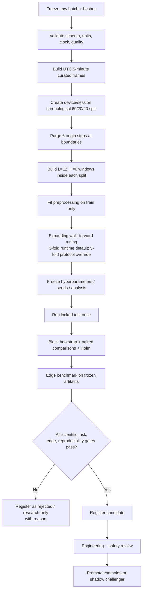
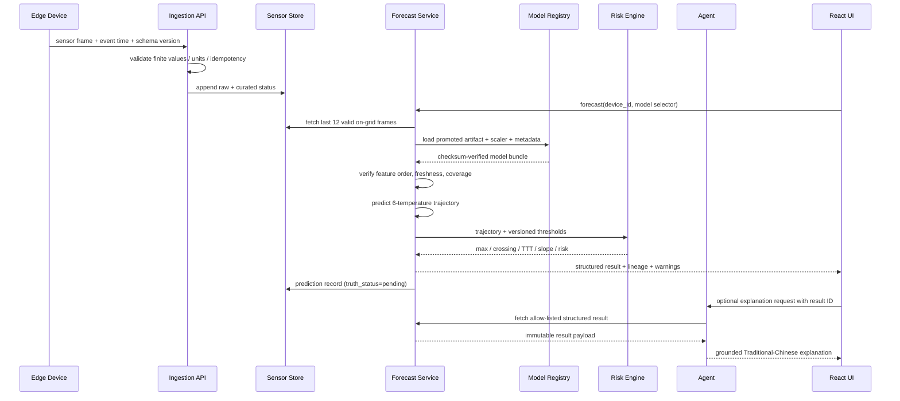
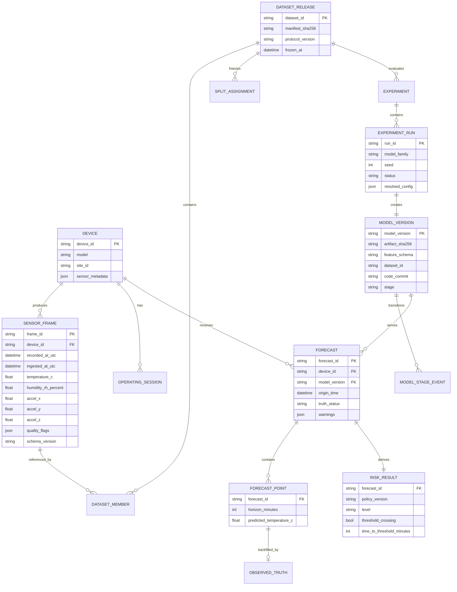
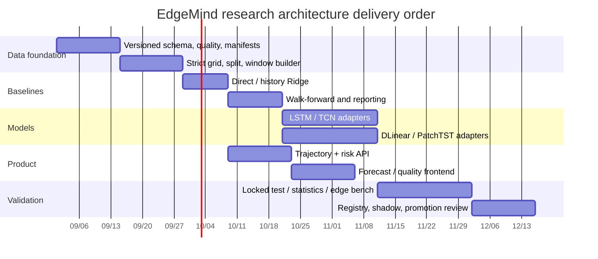

# EdgeMind 研究版完整系統架構

> 本文件是從現有產品演進到研究版 multi-horizon 系統的目標架構。標記為「現有」的能力可在目前 repository 找到；標記為「目標」的能力是 implementation contract，不能在完成前對外宣稱已提供。

## 1. 架構範圍與原則

研究版由三條彼此隔離但可追溯的路徑組成：

1. **資料路徑**：真實 edge sensor → immutable raw → validated 5-minute frames → frozen dataset/split/window manifests。
2. **研究路徑**：同一 windows → 公平調參與模型比較 → locked-test statistics → model registry。
3. **服務路徑**：最近 60 分鐘 → promoted model → 未來 5–30 分鐘軌跡 → deterministic risk engine → API／Agent／前端。

核心原則：

- 數值模型產生預測，確定性 risk engine 做分類，Agent 只把結構化事實轉成人類可讀說明。
- Offline test 與 online telemetry 分開；沒有真值的即時預測不混入 test metrics。
- 每一預測可追溯到 model、scaler、feature schema、dataset/split 與 code version。
- 研究預設固定為 `history=12`、`horizons=5..30`、per-device chronological `60/20/20`、`gap=6 steps`；可配置，但變更會產生新的 protocol/version。
- 外部設備 cross-device test 必須整台 holdout，完全不參與 fit、preprocessing 與 tuning。
- 優先延續現有 Clean Architecture：`presentation → application → domain`，infrastructure 實作 application-owned ports，由 bootstrap 組裝。

## 2. 現況與目標差距

| 能力 | Production／legacy | 目前 research workbench | Formal／serving target |
| --- | --- | --- | --- |
| 感測輸入 | 單筆溫濕度、XYZ；PostgreSQL | 讀取同表並嚴格檢查 exact cadence、complete/finite、duplicate | 帶 event/ingestion time、品質與裝置 metadata 的版本化 frames |
| Forecast input | 最新單點 5 features | 最近 12 steps × 5 features；History Ridge 加 summaries | 線上 sequence buffer 與版本化 feature schema |
| Forecast output | +30 分鐘單一溫度 | 每次先完成歷史 locked-test 評估與全資料重訓，再輸出最新 12-step 的 +5/+10/+15/+20/+25/+30 pending-truth 軌跡、risk 與三張圖 | Promoted trajectory API、truth backfill、event warning |
| 模型 | 標準函式庫 Ridge | Direct Ridge／Ridge + History/Trend；研究依賴啟用 DLinear／LSTM／TCN／PatchTST | 公平 tuning、多 seeds、可部署 artifact variants |
| Validation | 最後 20%，無獨立 test | 60/20/20 + 6-step gap + runtime 預設 3-fold walk-forward；external device 全量 holdout | 預註冊 folds、locked-test access audit、block statistics |
| 模型保存 | 每 motor 最新 JSON | 每實驗 immutable JSON + 七張 ledger／分析 CSV 及 checksum | model versions、stage、lineage、完整 preprocessing bundle |
| Risk | 固定溫度門檻分類報表 | trajectory max/crossing/TTT/rate、Low/Medium/High、boundary-aware event evaluation | 工程核准與版本化 policy |
| Report | 每次 inference CSV/SVG、performance aggregate | model/per-horizon/ablation、prediction/split/event、paired block CI | per-device/seed、paired significance、Pareto、edge benchmark 完整 run bundle |
| UI | Chat + SSE status + SVG gallery | 研究工作台可選設備／history／horizon／threshold／推論模型，分開呈現最新軌跡與離線比較 | 完整時間軸、資料 freshness、model lineage、promotion views |

現有 `/api/predictions/train/{motor_id}` 與 `/api/predictions/temperature/{motor_id}` 應在相容期保留；新契約另加版本化 endpoint，不靜默改變舊 response shape。

## 3. Overall target architecture

```mermaid
flowchart LR
    subgraph Edge[Edge / Motor Site]
        S[Temperature / Humidity / XYZ Sensors]
        C[Collector<br/>clock sync, buffer, unit metadata]
        ER[Optional Edge Runtime<br/>preprocess + promoted model]
        S --> C
        C --> ER
    end

    subgraph Data[Data Plane]
        IG[Ingestion API]
        RAW[(Immutable Raw Store)]
        V[Schema & Quality Validation]
        CUR[(Curated 5-minute Frames)]
        DS[Dataset / Split / Window Builder]
        MAN[(Versioned Manifests)]
        IG --> RAW --> V --> CUR --> DS --> MAN
    end

    subgraph Research[Offline Research Plane]
        ORCH[Experiment Orchestrator]
        PRE[Fold-owned Preprocessing]
        MODELS[Direct Ridge / Ridge + History<br/>DLinear / LSTM / TCN / PatchTST]
        EVAL[Regression + Risk + Statistics]
        BENCH[Target-hardware Benchmark]
        REG[(Model Registry)]
        MAN --> ORCH --> PRE --> MODELS --> EVAL --> BENCH --> REG
    end

    subgraph Serving[Online Serving Plane]
        SEQ[Sequence Buffer<br/>12 valid frames]
        FS[Feature Schema + Scaler]
        INF[Trajectory Inference]
        RISK[Deterministic Risk Engine]
        API[REST / SSE API]
        AGENT[Grounded Agent Explanation]
        SEQ --> FS --> INF --> RISK --> API
        API --> AGENT
    end

    subgraph Experience[User Experience]
        WEB[React Dashboard / Chat]
        ART[Charts / CSV / Model Card]
        WEB --> ART
    end

    C --> IG
    CUR --> SEQ
    REG -->|promoted artifact + checksum| FS
    ER -. optional local inference .-> API
    API --> WEB
    EVAL --> ART
    BENCH --> ART
    API --> OBS[(Telemetry / Pending Truth / Drift)]
    OBS --> RAW
```



## 4. Offline research workflow



每個方塊都必須寫出不可覆寫 artifact。Orchestrator 不應只把結果塞進 console；它要能從 `config.resolved.yaml + manifest hashes + code commit` 重建 run。

## 5. Online forecast sequence

下圖是正式 serving target。現有 prototype 已提供 `/api/research/forecasts`：每次 request 只用 forecast origin 以前可得的完整標籤，先做帶 purge gap 的 chronological validation／locked-test 評估，再以全部已知歷史標籤重訓所選 registry adapter，對最新精確 12 格推論，保存 immutable JSON、三張 SVG，並標示未來真值 `pending`。它尚未載入 promoted model bundle，也尚未自動 backfill truth；因此不能把 prototype latency 當成正式常駐模型 serving latency。



若最近 12 格不足、資料過舊、artifact checksum 不符或 feature schema 不相容，Forecast Service 應回傳 typed error 與原因，不能以零補齊後產生看似正常的數字。Agent 必須原樣說明不可預測，不得猜測。

## 6. Backend component design

### 6.1 Domain layer

保持 framework-independent，新增或擴充下列概念：

| Component | 責任 | 不負責 |
| --- | --- | --- |
| `SequenceWindow` | 12×5 predictor、6 targets、origin、sample lineage invariants | DB query、NumPy／Torch training loop |
| `SplitPolicy` | Development device 使用 60/20/20、gap=6、strict-gap sensitivity；external device 全量 holdout；維持 session/event integrity | 讀寫檔案 |
| `ForecastTrajectory` | horizon → temperature，單位與時間一致性 | Agent 文案 |
| `RiskPolicy` | warning/critical/rate 版本；純函式計算 max/crossing/TTT/risk | 由 test 自動挑安全門檻 |
| `Evaluation` | regression、classification、event matching、descriptive metrics | 持久化、畫圖 |
| `ModelSpec` | family、feature schema、horizons、hyperparameters、seed | framework-specific artifact bytes |

RiskPolicy 需可單元測試，例如「未越界的 TTT 是 null」、「第一個 +15 點越界，TTT=15」、「NaN trajectory 被拒絕」。

### 6.2 Application layer

Application use cases 協調 domain 與 ports：

- `IngestSensorFrame`：驗證 contract、去重、保存品質狀態。
- `BuildDatasetRelease`：凍結 manifest、split、window lineage。
- `RunExperiment`：執行模型矩陣、seed、walk-forward、locked test；runtime 預設 3 folds，正式 protocol 可明確 override 5 folds。
- `RegisterModel`／`PromoteModel`：檢查 gates 與 stage transition。
- `ForecastTrajectory`：取得 12 frames、model bundle、預測、risk、保存結果。
- `BackfillTruth`：horizon 到達後配對真值，更新 pending prediction；不重寫原預測。
- `EvaluateModel`：離線與 shadow 指標分開聚合。
- `ExplainDiagnostic`：把已保存 result 交給 Agent gateway，不讓 Agent 直接組 SQL 或執行任意模型。

建議 ports：`SensorFrameRepository`, `DatasetManifestRepository`, `ExperimentRunner`, `ModelArtifactRepository`, `ModelRegistryRepository`, `PredictionRepository`, `RiskPolicyRepository`, `ReportGateway`, `Clock`, `AgentModelGateway`。交易邊界由 Unit of Work 控制，artifact store 的 finalize 採先寫 temporary、checksum 通過後 atomic publish。

### 6.3 Infrastructure layer

- PostgreSQL：sensor metadata、curated frames index、model registry metadata、prediction／truth、experiment status。
- Object／filesystem artifact store：raw partitions、Parquet windows、model bundles、run outputs、charts。
- Model adapters：`RidgeAdapter`, `TorchSequenceAdapter` 共用 `fit/predict/save/load/metadata` port。
- Runtime adapter：對 target device 的 ONNX Runtime／TFLite／原生 runtime；同一 test vectors 驗證輸出容差。
- Reporting：由 prediction parquet 產生 tables/charts；禁止把示意值寫入結果。
- Telemetry：latency histogram、RSS、coverage、data freshness、error type、model version；不記錄 secret 或不必要的完整 prompt。

現有 `FilesystemReportGateway`、PostgreSQL repositories 與 model JSON 可以逐步擴充，不需要推倒原本分層。

### 6.4 Presentation layer

- Pydantic／OpenAPI 定義版本化 request/response。
- Route 只做 transport validation、呼叫 use case、映射 typed errors；不直接 fit scaler 或讀 artifact。
- 正式 scale-up 的長時間 training 應回 `202 Accepted + experiment_id`，由 status endpoint 或 SSE 報進度；目前 `/api/research/experiments` 是同步 `201`，尚未提供 queue／cancel／resume。
- Chart endpoint 延續目前 allow-list/path traversal 防護；research artifacts 需另外權限與 content-type allow-list。

## 7. Storage model

以下是概念資料表；欄位命名可依 migration 慣例調整，但 lineage 不可省略。



Model artifact bundle 最少包含：

```text
model/<model_version>/
├── model.onnx | model.json | model.ubj | model.pt
├── preprocessing.json
├── feature_schema.json
├── risk_policy_ref.json
├── model_card.json
├── test_vectors.json
├── environment.lock
└── checksums.sha256
```

Registry stage 建議：`research → candidate → shadow → production → retired/rejected`。只有 gates 通過不代表自動 production；promotion 需要具名審查紀錄。Rollback 只切換 active pointer，不刪除舊 artifact。

## 8. API contracts

### 8.1 相容 endpoint（現有）

- `POST /api/sensor-readings`
- `POST /api/predictions/train/{motor_id}`
- `GET /api/predictions/temperature/{motor_id}`
- Chat／performance／report artifact endpoints

現有 endpoint 繼續代表 legacy +30 Ridge，response 中應逐步加入 `contract_version`／`legacy: true`，但不得突然把 `predicted_temperature` 改成 array。

### 8.2 研究工作台 endpoint（已實作）

| Method/path | 行為 |
| --- | --- |
| `GET /api/research/config` | 回 protocol defaults、device inventory、readiness hints 與每個模型 availability/reason |
| `POST /api/research/experiments` | 同步執行實驗，成功以 `201 Created` 回 completed result 與 artifact paths |
| `GET /api/research/experiments/{experiment_id}` | 讀取已保存的 32 位小寫 hex ID 結果；無效或不存在回 404 |
| `POST /api/research/forecasts` | 同步擬合可用模型並對最新精確 history 產生六點 pending-truth 軌跡、risk、lineage 與 leakage audit，成功回 `201 Created` |
| `GET /api/research/forecasts/{forecast_id}` | 讀取已保存的 32 位小寫 hex forecast；無效或不存在回 404 |

POST 支援 `training_motor_id`, `evaluation_motor_id`, `history_minutes`, `horizons_minutes`, `threshold_c`, `model_names`, `include_ablations`, `sampling_minutes`, `train_fraction`, `validation_fraction`, `gap_steps`, `walk_forward_folds`, `random_seed`。額外欄位由 schema 拒絕，horizon 限定 5–60 分鐘且 gap 不得小於最遠 horizon 所需 steps；目前 application safety envelope 另限制 `threshold_c` 為 20–120°C，但其中實際採用值仍須由設備規格與安全審查核准。

Forecast POST 支援 `motor_id`, `training_motor_id`, `model_name`, `history_minutes`, `horizons_minutes`, `threshold_c`, `sampling_minutes`, `random_seed`。最新 history 任一格缺失、重複、不完整或非 finite 都 fail closed；模型 training label 晚於 forecast origin 也會拒絕。回應包含 historical validation／locked-test MAE、RMSE、R²、MAPE、source history shape/time、所有 target time／prediction、risk、model cost、三張圖、資料 hash 與 `future_truth_used_for_prediction=false`。

研究結果保存於：

```text
<INFERENCE_OUTPUT_DIR>/research_experiments/<experiment_id>/
├── result.json
├── model_comparison.csv
├── horizon_metrics.csv
├── feature_ablations.csv
├── predictions.csv
├── split_manifest.csv
├── risk_events.csv
└── statistical_comparisons.csv

<INFERENCE_OUTPUT_DIR>/research_forecasts/<forecast_id>/
└── result.json
```

`requirements.txt` 只讓兩個 Ridge 模型 available；Compose 預設使用 CPU-only `requirements-research.txt`，因此會註冊 DLinear／LSTM／TCN／PatchTST adapters。API config 回傳的 availability 是當下 runtime 真相；資源受限 edge image 可明確 override 回輕量 requirements。

目前 POST 是同步，適合受控本機實驗。當資料、trial、seed 與深度模型增加時應演進為 queue/background worker；在那之前，前端不能把尚未實作的排隊、取消或 resume 說成已有能力。

### 8.3 正式服務與治理 endpoint（目標）

| Method/path | 用途 |
| --- | --- |
| `POST /api/v1/sensor-frames` | 帶 idempotency key 與 schema version ingest |
| `GET /api/v1/devices/{id}/data-quality` | coverage、freshness、missing、clock status |
| `POST /api/v1/experiments` | 以 frozen dataset/config 建立非同步 run |
| `GET /api/v1/experiments/{id}` | progress、fold／seed status、artifact links |
| `POST /api/v1/models/{version}/promotions` | 經權限與 gate report 變更 stage |
| `POST /api/v1/forecasts/temperature-trajectory` | 取得 5–30 分鐘軌跡與 risk |
| `GET /api/v1/forecasts/{id}` | 取得 immutable prediction 與 truth status |
| `GET /api/v1/models/{version}/model-card` | lineage、metrics、適用範圍與限制 |
| `GET /api/v1/reports/comparisons/{experiment_id}` | 模型矩陣、ablation、CI、edge metrics |

Trajectory request：

```json
{
  "device_id": "MOTOR-A",
  "model_selector": "production",
  "as_of": "2026-08-27T12:00:00Z",
  "include_explanation": false
}
```

Trajectory response：

```json
{
  "contract_version": "forecast-trajectory-v1",
  "forecast_id": "fcst_...",
  "device_id": "MOTOR-A",
  "origin_time": "2026-08-27T12:00:00Z",
  "model_version": "tcn-...",
  "dataset_protocol": "edgemind-real-v1",
  "input": {
    "history_steps": 12,
    "cadence_minutes": 5,
    "coverage": 1.0,
    "latest_age_seconds": 8
  },
  "trajectory": [
    {"horizon_minutes": 5, "target_time": "2026-08-27T12:05:00Z", "temperature_c": null},
    {"horizon_minutes": 10, "target_time": "2026-08-27T12:10:00Z", "temperature_c": null},
    {"horizon_minutes": 15, "target_time": "2026-08-27T12:15:00Z", "temperature_c": null},
    {"horizon_minutes": 20, "target_time": "2026-08-27T12:20:00Z", "temperature_c": null},
    {"horizon_minutes": 25, "target_time": "2026-08-27T12:25:00Z", "temperature_c": null},
    {"horizon_minutes": 30, "target_time": "2026-08-27T12:30:00Z", "temperature_c": null}
  ],
  "risk": {
    "policy_version": "site-a-motor-v1",
    "level": "unknown_until_computed",
    "predicted_max_temperature_c": null,
    "threshold_crossing": null,
    "time_to_threshold_minutes": null,
    "heating_rate_c_per_min": null
  },
  "truth_status": "pending",
  "warnings": []
}
```

`null` 是文件 schema placeholder，實際成功 response 必須是 finite 數值；資料不足時應回 typed `422 insufficient_history`，而非傳出這份 placeholder。

### 8.4 目標 Error contract

```json
{
  "error": {
    "code": "insufficient_history",
    "message": "最近 60 分鐘沒有 12 個合格格點",
    "details": {"required_steps": 12, "valid_steps": 9},
    "request_id": "req_..."
  }
}
```

其他明確 code：`stale_sensor_data`, `feature_schema_mismatch`, `model_not_promoted`, `artifact_checksum_failed`, `unknown_risk_policy`, `experiment_not_frozen`。內部 stack trace 不回給前端。

## 9. Frontend information architecture

目前 `ResearchWorkspace` 已在保留 Chat/SSE 的前提下提供：training/evaluation device、history、horizons、threshold 與可用推論模型設定；latest exact 12-step pending-truth 軌跡；資料 eligibility/warning；provenance、quality 與 chronological split；模型 MAE/RMSE/max error/R²/cross-device MAE/latency/training time/size；per-horizon 表；feature ablation；保留測試集最後一條軌跡、衍生 risk 與分類指標；methodology/leakage controls。最新預測與 offline holdout 卡片有不同來源說明，不混為即時指標。Unavailable 模型顯示 reason，不補示意分數。POST 目前同步等待 completed response，hook 兼容未來非同步實驗狀態但 backend 尚未提供 background job。

Offline risk panel 只以 development walk-forward aggregate MAE（若無則 validation MAE）選擇一條保留樣本軌跡作閱讀示範，不讀 locked-test 或 external-test MAE 來決定顯示模型。這仍只是 UI display choice，不代表已 promotion；最新軌跡 panel 則明示使用者實際選用的 adapter 與 `pending` truth。正式候選必須依預註冊的多 seed、統計、edge 與風險 gates 選定，再對 locked test 評一次，不能看 test／external-test 結果後反向 promotion。

下列是後續完整產品 information architecture；未在上段列出的 Overview、Model Registry、promotion 等仍是目標，不能視為現有頁面：

```text
EdgeMind
├── Overview
│   ├── Device health / freshness
│   ├── Current risk and active warnings
│   └── Data quality alerts
├── Device Detail
│   ├── Last 60-minute sensor history
│   ├── +5..+30 forecast trajectory with thresholds
│   ├── max / crossing / time-to-threshold / slope cards
│   └── model version, generated time, pending truth
├── Research
│   ├── Model comparison and 95% CI
│   ├── Feature ablation
│   ├── Horizon error
│   ├── Cross-device matrix
│   └── Accuracy–latency–memory Pareto
├── Data Quality
│   ├── coverage / missing / clock / exclusions
│   └── dataset and split manifests
├── Model Registry
│   ├── model cards / lineage / stages
│   └── promotion history / rollback
└── Diagnostic Chat
    └── grounded explanation + links to exact forecast/report
```

### 9.1 Forecast UI requirements

- 一張共同時間軸顯示最近 60 分鐘 actual 與未來 30 分鐘 predicted trajectory，明確用實線／虛線區分。
- 顯示所有六個 horizon，不只挑最好看的點；tooltip 包含 target time、model version 與是否已有真值。
- warning／critical threshold 是有標籤的水平線，顯示 policy version，不用只靠顏色。
- Low／Medium／High 同時顯示文字、icon 與顏色，符合 accessibility；資料不足顯示 Unknown，不誤標 Low。
- 顯示資料 freshness、history coverage、跨設備模型來源與 warnings。
- 若提供信賴區間，必須來自實作並經 calibration 評估；在此之前 UI 不應畫假的 uncertainty band。

### 9.2 Research UI requirements

- 所有表格列出 dataset version、split、test devices/windows/events、seed count。
- 支援切換 per-device macro 與 pooled，但 primary 標示 macro。
- 95% CI 與 effect size 和點估計一起顯示；不以星號取代實際數字。
- DEMO run 加醒目 Synthetic badge，不能與 Real locked-test 排名混排。
- 失敗 run／OOM／資料不足可被檢視，不因只顯示成功者造成 selection bias。

### 9.3 Chat guardrails

- 目前 Agent 對軌跡／過熱／多時域關鍵字採確定性路由，工具接收 `motor_id + training_motor_id + model_name + threshold_c + horizons_minutes`；像「40°C、5 到 60 分鐘」會原樣進入 ResearchService，而不是靜默改回預設值。後端完成歷史評估、重訓、推論、risk 與圖表後，Agent 以單一 success event 回傳確定性報告及附件；即時 pending truth 不會被誤稱為缺少模型誤差。
- 回答必須提及 origin time、horizon、model version、risk level 與資料品質 warning。
- Agent 不可把 validation 當 test，不可把 DEMO 指標描述為真實設備結果，不可把關聯說成因果。
- 維護建議使用經核准模板；High risk 建議人工檢查／依 SOP 處理，不自行控制設備或保證故障。
- Agent 服務失效時，結構化 forecast 與 risk UI 仍完整可用。

## 10. Model serving and edge deployment

### 10.1 Bundle validation

啟動或切換模型時：

1. 驗證 stage 是 production／approved shadow。
2. 驗證 artifact、preprocessing 與 schema checksum。
3. 執行 bundled test vectors，輸出需在 model-specific tolerance 內。
4. 驗證 horizons 恰為 `[5,10,15,20,25,30]`、feature order 與 units。
5. 驗證 risk policy 存在且適用該 device class/site。
6. 通過後 atomic swap；失敗保留原 champion 並告警。

### 10.2 Inference modes

- **Central serving**：collector 上傳 frames，由 backend 推論；適合研究期與集中管理。
- **Edge serving**：promotion pipeline 將簽章 bundle 下發 gateway，離線也能預測；恢復連線後上傳 prediction lineage。
- 同一 model version 需用 golden test vectors 比對 central 與 edge runtime。若量化模型輸出不同，視為新的 artifact variant，分開 benchmark。

### 10.3 Champion/challenger

Production champion 的結果供 UI/告警；challenger 只 shadow 計算，不觸發維護告警。取得延遲真值後分開評估。達到預先設定 observation duration、event count 與 gates，再由人工 promotion。

## 11. Observability、drift 與再訓練

### 11.1 線上指標

- ingest rate、duplicate rate、late rate、off-grid rate、feature valid rate。
- input freshness、12-step sequence coverage、forecast success/error code。
- preprocess/model/risk/end-to-end latency histograms，model version 維度。
- predicted temperature/risk distribution；真值到達後的 rolling MAE、bias、event recall/false alarms。
- Agent error/timeout 與 grounding payload ID；Agent latency不混入純模型 latency。

### 11.2 Drift

- Feature drift：以 training reference 比較 PSI／KS 或 Wasserstein，依 feature/device 分層。
- Residual drift：真值回填後監測 rolling MAE、bias 與 calibration。
- Context drift：firmware、sensor、位置、校正、維修、季節、load distribution 改變。
- Drift alert 只觸發調查／候選再訓練，不直接自動 promotion。

### 11.3 Truth lifecycle

即時 forecast 初始為 `pending`。到各 target time 後，BackfillTruth 以 strict grid 取得實測溫度：存在則新增 immutable truth record，缺失則標 `missing_truth`。修改過的 sensor reading 要產生新 data version，歷史評估不得無痕改寫。

## 12. Security、權限與可靠性

- Sensor ingest 用設備 identity、TLS、rate limit、idempotency key；研究與 promotion API 採 RBAC。
- Gemini/API keys 與 DB credentials 只放 secret manager／環境，不進 artifact、prompt 或 logs。
- Model/artifact URL 需 allow-list、content type 與 path traversal 防護；下載需要授權。
- Manifest、model、risk policy 與 promotion event 做 checksum／append-only audit。
- Training job 有 CPU/GPU/memory/time quota；失敗留下狀態，temporary artifacts 可安全清理。
- DB unavailable 時 edge buffer；model registry unavailable 時可繼續用最後一次驗證成功的 champion，並顯示 stale registry warning。
- Risk engine 或 model 不可用時 fail closed 為 `Unknown / prediction unavailable`，不可默認 Low。
- Automated actuation 不在本研究範圍；若日後加入，需要獨立 hazard analysis、interlock 與人機權責。

## 13. Verification strategy

| 層級 | 必要測試 |
| --- | --- |
| Domain unit | window 邊界、gap、risk/TTT、metrics、event matching、finite checks |
| Property test | 任意亂序／重複／缺值不產生跨 split window；horizon target 必晚於 origin |
| Adapter contract | 每個 model adapter predict shape、save/load equivalence、feature order rejection |
| Integration | PostgreSQL transaction、artifact atomic publish、truth backfill、registry rollback |
| API | schema/version、typed errors、auth、idempotency、SSE cancellation |
| Frontend | trajectory times、Unknown state、threshold labels、synthetic badge、accessibility |
| Reproducibility | frozen config+manifest 重跑、hash/seed/environment 完整 |
| Edge | golden vectors、FP32/quantized tolerance、latency/RAM harness |
| Architecture | 延續 domain/application 禁止反向依賴的 import boundary test |

## 14. 分階段實作順序



日期只是呈現依賴順序的規劃範例，不是承諾時程。實際迭代 gate：

1. **Phase A — data first**：schema、strict windows、60/20/20、gap、leakage tests。
2. **Phase B — honest baselines**：M0–M3 與 per-horizon artifacts 完成後才導入深度模型。
3. **Phase C — model matrix**：M4–M10、五 seeds、walk-forward、ablation、cross-device。
4. **Phase D — serving experience**：trajectory/risk contract 與 UI；保留 legacy endpoints。
5. **Phase E — edge and governance**：target hardware benchmark、registry、shadow、manual promotion。

## 15. Research-to-system traceability

| 研究問題 | 系統資料／元件 | 核心 artifact |
| --- | --- | --- |
| RQ1 history value | SequenceWindow、Ridge Snapshot/History | paired predictions + ablation table |
| RQ2 model families | Model adapters、Experiment Orchestrator | model comparison + CI |
| RQ3 sensor value | Feature schema、ablation configs | feature ablation CSV |
| RQ4 useful horizon | ForecastTrajectory | metrics_by_horizon + lead time |
| RQ5 cross-device | Dataset/split groups、registry metadata | leave-one-device-out matrix |
| RQ6 edge tradeoff | Edge benchmark harness | Pareto table/chart |
| RQ7 warning value | RiskPolicy、BackfillTruth、event matcher | risk_events + false alarms/day |

完整實驗規則見 [RESEARCH_METHOD.md](./RESEARCH_METHOD.md)，資料收集、缺失處理與 leakage 防護見 [DATASET_PROTOCOL.md](./DATASET_PROTOCOL.md)。三份文件應共用同一 `protocol_version`；任何核心預設變更都要同步版本化，而不是只更新其中一頁。
